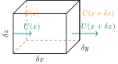
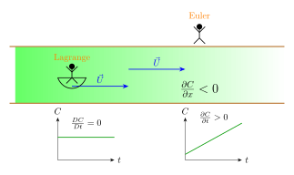
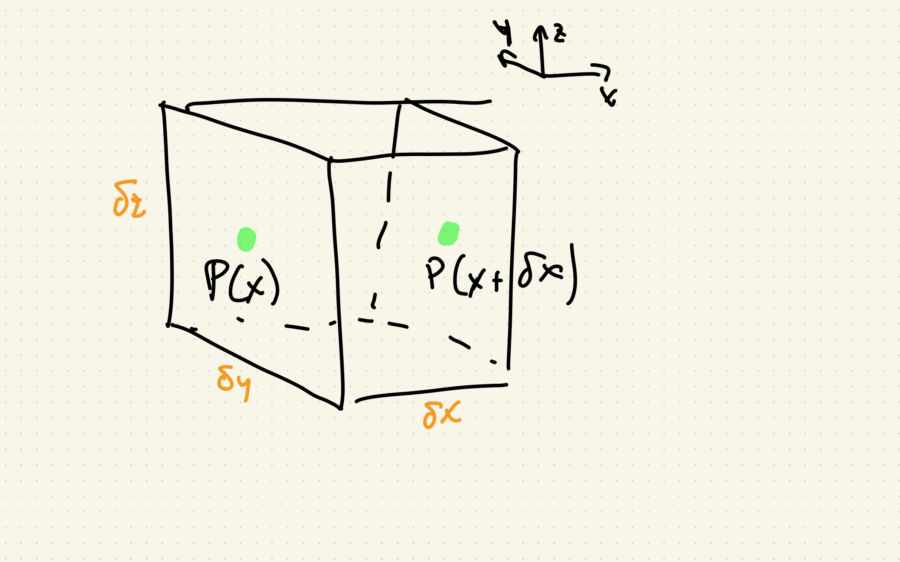
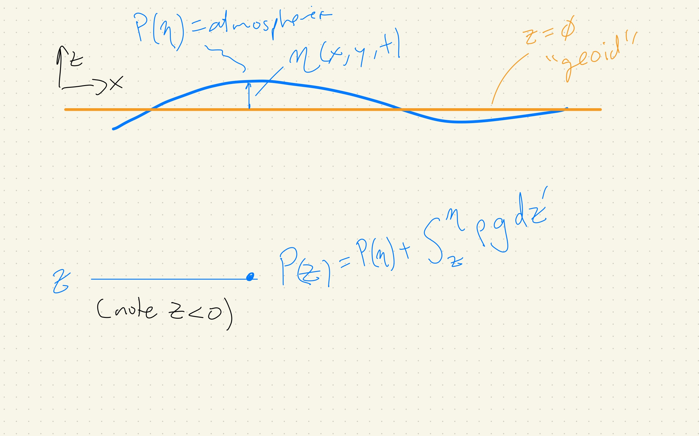
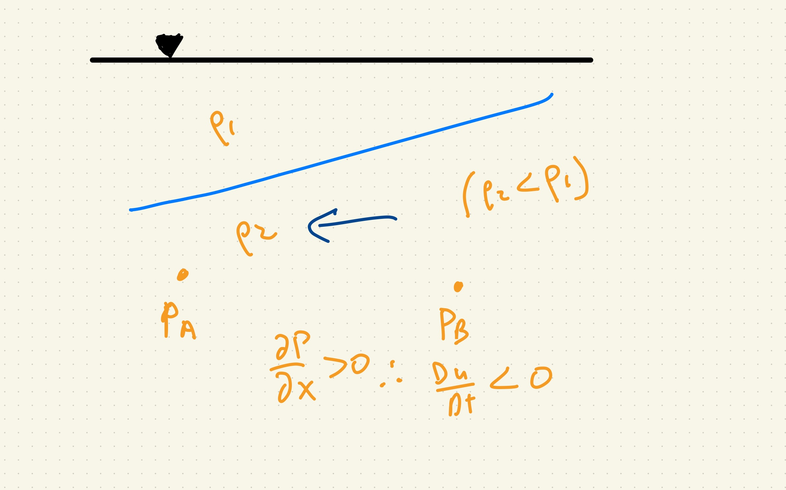
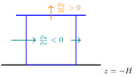
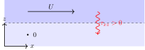
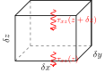
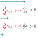

# Introduction to Physical Oceanography: Geophysical Fluid Dynamics

## Course text:

Much of the course material is based on the textbook ``Introduction to Geophysical Fluid Dynamics'' by Benoit Cushman-Roisin and Jean-Marie Beckers, 2011, Academic Press. The book is available online through the library.

## Why Geophysical Fluid Dynamics?

- What is it:?
  - The study of the motion of fluids in the atmosphere and oceans, with a focus on large-scale phenomena.
- Why is it important?
  - Applications:
    - Weather forecasting
    - Climate modeling
    - Ocean circulation studies
    - Environmental monitoring
  - Slides:
    - Hurricane
    - North Pacific Gyre
      - have velocity on here!
    - Overturning Circulation
      - strength of circulation is about 10 Sv (1 Sv = 10^6 m^3/s)

## Characteristics:
  - Normal fluid dynamics:
    - pressure moves water
    - water can exert *shear stresses* on itself.
  - Plus:
    - Earth's rotation matters
    - Density stratification matters
  - Scales:
    - Hurricane:
      - $L = 800$ km across, $U = 55$ m/s winds
      - translation speed $c= 250 km/ d = 3 m/s$
      - timescale?
        - rotation = $\pi 400\times10^3 / 55 = 8 h$;
        - translation = $800 /250 = 3.2 d$;
    - North Pacific Gyre:
      - $L = 10_000$ km across, $U = 1$ m/s$ (in Kurosio, much slower elsewhere)
      - timescale: > 100 d in Kuroshio.
    - Overturning Circulation:
      - $H = 4000 m$,
      - $w = <0.01 m/d = 3 m /y = 10^{-7} \mathrm{m/s}$ (how do we measure this?, can we?)
        - $10^{7} m^3/s / 10^7 m / 10^7 m = 10^{-7} \mathrm{m/s}$.
      - timescale is about 1000 years.
    - Rotation timescale:
      - $\Omega = \frac{2\pi}{24 \times 3600} \approx 7.27 \times 10^{-5} \mathrm{rad/s}$.
      - $f = 2\Omega \sin(\phi)$, where $\phi$ is latitude.
      - $f=0$ at equator, $\pm2\Omega$ at poles, and $\pm10^{-4} \mathrm{rad/s}$ at 45 N/S.
      - So at the equator, the *inertial period* tends to infinity!. At 45 N it is 17.45 h.  At the north pole it is 12 h.
      - motions that last longer than the inertial period are called *geostrophic*.
    - Aspect ratio:
      - very flat!  10000 km/4 km = 1:2500.
      - horizontal velocities are much larger than vertical ones.  $U \ sim 0.01 m/s$ versus $W \sim 10^{-7} m/s$. ($1:10^5$ instead of $1:2.5\times10^3$).

- Slide:
  - Table 1.2 and Figure  1.7 from CR.

## Course structure:
- Discussion of the course structure, assignments, and expectations.

# Thermodynamics of water
- T: energy of water due to molecular vibrations.
- Salt: g solids/ kg water.
  - ratios of constituent solids relatively constant in the ocean
    - residence time of a salt solids is on order of 10^6 years or so (versus 1000 y for mixing timescale), so well-mixed except very close to a river.
    - Some small geographical differences (TEOS10 is a good resource).
  - about 35 g/kg;
    - measured via deriving the mass of solids
    - titrate with silver nitrate to precipitate chloride, then measure the mass of the precipitate.
    - measure via conductivity
      - fast and electronic, therefore easier.
      - depends on temperature and pressure as well, so need corrections to get salinity
- Pressure:
  - force that molecules exert on one another due to their kinetic energy.
  - omni-directional
  - $\delta\mathbf{F} = P \delta\mathbf{A}$
  - $N / m^2 = Pa$
  - A decibar is defined as $\mathrm{dbar}$ = 10^4 Pa approx  weight of 1 m of water
- Density:
  - mass per unit volume ($\rho_0(S=0\ \mathrm{psu}, T=4\ \mathrm{°C} , P=1\ \mathrm{atm}) = 1000\ \mathrm{kg\,m^{-3}}$).
  - Equation of state is very non-linear:
  $$\rho = \rho(S, T, P)$$
    - $S$ is salinity, $T$ is temperature, and $P$ is pressure.
    - evaluated on a computer via polynomial fits.  Historically PSS-78, now TEOS10, though we will use PSS-78 mostly for   convenience.
    - SLIDE OF EOS.
    - Thermal expansion coefficient $\alpha = -\frac{1}{\rho}\frac{\partial \rho}{\partial T}$, haline contraction: $\beta = \frac{1}{\rho}\frac{\partial \rho}{\partial P}$.
    - $\alpha$ is about $2\times10^{-4} \mathrm{K}^{-1}$ at $S=35\ \mathrm{psu}, T=15\ \mathrm{°C}, P=1\ \mathrm{atm}$.
      - So for a 1 K change in temperature, the density changes by about 0.2 kg/m^3.
    - $\beta(35, 15, 0)$ is about $7.5 \times 10^{-4} \mathrm{psu}^{-1}$.
      - So for a 1 psu change in salinity, the density changes by about 0.7 kg/m^3.
    - $\gamma(35, 15, 0)$ is about $4.5 \times 10^{-6} \mathrm{dbar}^{-1}$.
      - So for a 1 dbar change in pressure, the density changes by about .0045 kg/m^3.
      - Over 4000 dbar depth of ocean $\delta \rho \approx 18 \mathrm{kg/m^3}$.
  - Bousinesque Approximation:
    - small variations in density can be ignored except in "buoyancy" terms (where $\rho$ is multiplied by gravity).
    - eg $\rho \approx \rho_0 + \delta\rho$, where $\delta\rho$ is small.
    - this particularly comes up in the momentum equations, where we ignore the density variations compared to the velocity variations: momentum (per $m^3$) is $\rho u \approx \rho_0 u$, so terms like $\partial (\rho u)/\partial x \approx \rho_0 \partial u/\partial x$.
    - $\delta\rho/\rho_0 \approx 0.04$ over the whole ocean, and much less in the horizontal
      - eg the density of fresh water is $1000\ \mathrm{kg/m^3}$ whereas the density of seawater at 35 psu and 15 deg C is $1026\ \mathrm{kg/m^3}$.
  - Potential Temperature and Density
    - Salinity doesn't change due to compression by the weight of sewater above, but temperature and density go up without changing the total energy of the water (adiabatic temperature increase)
    - Temperature and salinity largely set at the ocean surface, and following a parcel of water only change at depth due to mixing or compression.
    - We often remove the compressive effect so on both temperature and density to better understand where the water came from and what mixing it has undergone.
    - Potential temperature $\theta$ is the temperature of a parcel of water if it were brought back to the surface with no heat exchange with the water around it.
      - slide of deep T cast and potential temperature.
      - slide with section of the two
    - Potential density $\sigma$ is the density of a parcel of water if it were brought back to the surface with no heat exchange with the water around it.
      - $\sigma_{\theta} = \rho(S, \theta, 0) - 1000\ \mathrm{kg/m^3}$.
      - $\sigma_{\theta}$ is often used instead of $\rho$ in oceanography.
      - note that the potential density is more nonlinear than potential temperature, and sometimes it is referenced to other depths than the surface.
      - show slide of potential densities.

# Conservation of a tracer (fluid dynamics "review")

Consider a tracer with a concentration $C(x,y,z,t)$ (with units like $\mathrm{g/m^3}$) that is advected by a flow with velocities $\mathbf{u} = (u,v,w)$, where $u$ is the velocity in the $x$ direction, $v$ in the $y$ direction, and $w$ in the $z$ direction.

Now consider a volume $V = \delta x \delta y \delta z$ that is a fixed cube in space.  The rate of change of tracer in the volume is given by the sum of _transport_ of tracers across the six faces into the volume:

$$ \int_V \frac{\partial C}{\partial t}  \, dV = -\int_S \mathbf{F_C} \cdot \mathbf{n} \, dS$$

where $\mathbf{F_C}$ is the _flux_ of $C$, $S$ is the surface of the volume and $\mathbf{n}$ is the outward normal vector to the surface.  Note that the _transport_ has units like g/s, and the _flux_ $F_C$ has units like g/m^2/s.

There are two types of fluxes that can change $C$, the _advective flux_ and the _diffusive flux_.  The _advective flux_ is that due to the flow of the water carrying the tracer and is given by
$$\mathbf{F_C} = C \mathbf{u}$$
Supposing for a second that diffusive fluxes are negligible, we can write the equation as

$$ \int_V \frac{\partial C}{\partial t}  \, dV = -\int_S C \mathbf{u} \cdot \mathbf{n} \, dS$$

We can evaluate these terms on our hypothetical volume $V$:

so
$$\delta x \delta y \delta z \frac{\partial C}{\partial t} = - (C(x+\delta x,y,z) u(x+\delta x, y, z) - C(x,y,z) u(x, y, z))\delta y\, \delta z - (C(x, y+\delta y,z) v(x, y+\delta y, z) - C(x,y,z) v(x, y, z))\delta x\, \delta z - (C(x, y, z +\delta z) w(x, y, z+\delta z) - C(x,y,z) w(x, y, z))\delta x\, \delta y $$

or simplifying:

$$\frac{\partial C}{\partial t} = - \left( \frac{C(x+\delta x,y,z) u(x+\delta x, y, z) - C(x,y,z) u(x, y, z)}{\delta x} + \frac{C(x, y+\delta y,z) v(x, y+\delta y, z) - C(x,y,z) v(x, y, z)}{\delta y} + \frac{C(x, y, z +\delta z) w(x, y, z+\delta z) - C(x,y,z) w(x, y, z)}{\delta z} \right)$$

or as the volume becomes infinitesimally small:

$$\frac{\partial C}{\partial t} = - \left( \frac{ \partial}{\partial x} \left(uC\right) + \frac{\partial}{\partial y}\left(vC\right) + \frac{\partial}{\partial z}\left(wC\right) \right) + \mathrm{diffusion}$$
or
$$\frac{\partial C}{\partial t} = - \nabla \cdot \left(\mathbf{u}C\right) + \mathrm{diffusion}$$

This equation is the _advection equation_ and, again, $\mathbf{u}C$ is the _advective flux_ of the tracer $C$.

Note we could also have done:
$$\int_V \frac{\partial C}{\partial t}  \, dV = -\int_S C \mathbf{u} \cdot \mathbf{n} \, dS$$
and by Gauss's theorem, we can convert the surface integral to a volume integral:
$$\int_V \frac{\partial C}{\partial t}  \, dV = -\int_V \nabla \cdot \left(C \mathbf{u} \right) \, dV$$

which gives the same equation as above.

## Diffusive fluxes
Diffusive fluxes are those due to the random motion of the tracer molecules, and are given by Fick's law:
$$\mathbf{F_C} = -K \nabla C$$

where $K$ is the diffusivity of the tracer (with units like m^2/s).  The diffusivity is a measure of how fast the tracer spreads out in space.  For example, for temperature, $K \approx 10^{-7} \mathrm{m^2/s}$, and for salt, $K \approx 10^{-9} \mathrm{m^2/s}$.
Substituting this into the conservation equation gives:
$$\frac{\partial C}{\partial t} = - \nabla \cdot \left(\mathbf{u}C\right) + K \nabla^2 C$$
This is the _advection-diffusion equation_ for a tracer $C$.

- All mixing takes place at the molecular level, but the diffusivity co-efficient is very small.
  - tends to act on small-scales
  - turbulent _stirring_ can enhance the fluxes, and is often parameterized as an "eddy diffusivity" or "turbulent diffusivity" $K_T$,
  - $K_T$ is much larger than molecular, but acts on larger scales.

## Conservation of water mass

The conservation of water mass can be written:
$$\frac{\partial \rho}{\partial t} + \nabla \cdot (\rho \mathbf{u}) = \mathrm{diffusion}$$
Ignoring diffusion, we can re-write as:
$$\frac{1}{\rho} \left(\frac{\partial \rho}{\partial t} +\mathbf{u}\cdot\nabla\rho\right) = - \nabla \cdot \mathbf{u}$$
- density of seawater only changes by 3% or so in the ocean, so the left hand side is small, or
$$\frac{\partial \rho}{\partial t} +\mathbf{u}\cdot\nabla\rho \approx 0$$
- so the right hand side is also small, or $\nabla \cdot \mathbf{u} \approx 0$.
- this is called the _incompressibility approximation_ and is a very good approximation for the ocean.
  - it is much less good for the atmosphere, but sometimes gets used there as well if flows are not too vertical.
- The integral form of this is:
- $$ \int_S \mathbf{u} \cdot \mathbf{n} \, dS = 0$$
- or the net flow of water into a volume is zero.

## Eulerian vs Lagrangian reference frames:

Physical laws are defined following a parcel of water (Lagrangian) For the above, the physical law is that the change of tracer following the fluid is due to diffusion:
$$\frac{D C}{D t} = K\nabla^2 C$$
From the above, we see that if the flow is incompressible, then
$$\frac{D \rho}{D t} = \frac{\partial \rho}{\partial t} + \mathbf{u}\cdot\nabla\rho = 0$$
$\frac{D C}{D t}$ is the _material derivative_ of $C$, and is the change of $C$ following a parcel of water.   It is also called the _Lagrangian derivative_.

The laws above were derived fixed in space, and so we derived an equation for the _Eulerian derivative_ of $C$:
$$\frac{\partial C}{\partial t} + \mathbf{u}\cdot\nabla C = K\nabla^2 C$$

As an example, consider a stream flowing at speed $U$ in the $x$ direction, and suppose the tracer is high upstream and low downstream.  Ignoring diffusion, if we follow the stream at a speed $U$, then the tracer will not change.  If we are sitting stationary on the bank, then $\partial C/\partial t = -U\partial C/\partial x$, which will be positive because $dC/dx < 0$ (the tracer is high upstream and low downstream).

# Conservation of momentum

The conservation of momentum is given by Newton's second law:
$$\frac{D}{Dt}\int_V \rho \mathbf{u} \, \mathrm{d}V = \sum \mathbf{F}$$
- what are the forces?
  - pressure gradient forces
  - viscous stress forces
  - Coriolis force
  - gravity force
  - The first two are interfacial forces that act on the edges of a given fluid volume.
  - The last two are body forces that act on the whole volume.

## gravity force:
Pretty straight forward, and only acts in the "vertical" direction:
  - $\rho \delta V \frac{D\mathbf{u}}{Dt} = -\rho \delta V g \mathbf{k} + ...$
  - $\mathbf{k}$ is the unit vector in the vertical direction, and $g$ is the acceleration due to gravity.
  - or $\frac{Dw}{Dt} = -g + ...$

## Pressure gradient force:

The pressure gradient force is a huge part of what gives fluids a very different class of behaviour than solids.  If water piles up somewhere, it creates pressure gradients inside the fluid that can drive accelerations.  Note this is not just the piled up water pouring downhill - the pressure gradient is felt throughout the water column, so even deep water will move.
- a demo using a small tank is very nice here, with a dye streak to show that all the water moves, not just the surface when there is a wave in the tank.

To derive the pressure gradient force we can consider a small cube again:

- Let's just consider the forces in the x-direction; these are exerted on the two faces perpendicular to the x-axis:
  - $$\rho \delta x\, \delta y, \delta z \frac{D u}{Dt} = -\left(P(x+\delta x,y,z) - P(x,y,z)\right) \delta y \delta z$$
  - or
  - $$\frac{D u}{Dt} = -\frac{1}{\rho}\left(\frac{\partial P}{\partial x}\right)+ ...$$
  - the same applies in the y- and z-directions, so we can write the momentum equation as:
  - $$\frac{D \mathbf{u}}{Dt} = -\frac{1}{\rho}\nabla P -g\mathbf{k} + ...$$

### Estimating pressure: hydrostatic approximation

In general in fluid dynamics, pressure can be "dynamic" and due to the motion of the fluid.  However, if vertical accelerations are small compared to the acceleration due to gravity, then we can assume that the pressure is hydrostatic:
$$ \frac{1}{\rho}\frac{\partial P}{\partial z} = - g - \frac{Dw}{Dt} \approx -g$$
if $|Dw/Dt| \ll g$.
- except for surface waves, and vigorous convection, this approximation is very good in the ocean, and therefore we can calculate the pressure at a depth $z$ if we know the density and the seasurface height $\eta$
$$ P(z) = P(\eta) + \int_z^{\eta} \rho g \, dz'$$
where $P(\eta)$ is the sealevel pressure (usually near 10 dbar or 10^5 Pa) at the ocean surface.

Note that if the density is constant, then this simplifies to
$$ P(z) = P(\eta) + \rho g (\eta - z)$$
and note that $z<0$ so the pressure increases as we go deeper.

The way to think about this is that the pressure at depth $z$ is the force per unit area needed to support the weight of the water above it, which is the weight of the water column from $z$ to the surface $\eta$.

Note that in the x- and y-momentum equations we have terms like
$$\frac{1}{\rho}\frac{\partial P}{\partial x}$$
If the flow is hydrostatic, then
$$\frac{Du}{Dt} = -\frac{1}{\rho}\frac{\partial P(\eta)}{\partial x} - \frac{1}{\rho}\frac{\partial}{\partial x} \int_z^{\eta} \rho g \, dz'$$
which we can use the Leibniz rule to write as
$$\frac{Du}{Dt} = -\frac{1}{\rho}\frac{\partial P(\eta)}{\partial x} - \frac{\partial \eta}{\partial x} g + \frac{1}{\rho}\int_z^{\eta(x)} \frac{\partial \rho}{\partial x} g\,\mathrm{d}z$$
For most practical purposes the first term is small because atmospheric sea level pressure doesn't vary much, and does so over large areas.  In the third term, the contribution of the density gradient from $z=0 to \eta$ is small, so we simplify to:
$$\frac{Du}{Dt} = - \frac{\partial \eta}{\partial x} g - \frac{1}{\rho_0}\int_z^0 \frac{\partial \rho}{\partial x} g\,\mathrm{d}z$$
The first term on the right hand side is the acceleration due to sea surface height gradients, and is called the _barotropic pressure gradient force_.  The second term is the acceleration due to density gradients, and is called the _baroclinic pressure gradient force_.

As an example of the baroclinic pressure gradient force, in the above sketch, the weight of the water at A is less than the weight of the water column at B, so the pressure at A is less than the pressure at B, and therefore there is a net pressure gradient from from B towards A, and the water in the bottom layer will accelerate to the left.
  - soon after there will be change in the surface pressure gradient as water piles up at A and is removed from B.
  - note that we could _calculate_ the pressure gradient force if we knew the thickness of the upper layer $h_1(x)$:
  - $$-\frac{1}{\rho}\frac{\partial P}{\partial x} = g \frac{\rho_2-\rho_1}{\rho_2} \frac{\partial h_1}{\partial x}$$

## Application: Linear hydrostatic surface waves

Consider a fluid with constant density $\rho=\rho_0$, and lets ignore the Coriolis force and viscosity.  Ignoring the y-dimension, the x-momentum equation is then:
$$ \frac{\partial u}{\partial t} + u\frac{\partial u}{\partial x} + w\frac{\partial u}{\partialz} = -\frac{1}{\rho_0}\frac{\partial P}{\partial x}$$
and the continuity equation is:
$$ \frac{\partial w}{\partial z} + \frac{\partial u}{\partial x} = 0$$
We can derive useful equations for surface waves if we assume that the vertical accelerations are small compared to the gravity force so that we can make the hydrostatic approximation, and that the waves are small enough amplitude that the nonlinear terms can be ignored.

The x-momentum then becomes:
$$ \frac{\partial u}{\partial t} = -g\frac{\partial \eta}{\partial x}$$
We can simplify the continuity equation by integrating in depth and assuming that $\eta \ll H$ (the depth of the ocean):
$$ \int{-H}^{\eta} \frac{\partial u}{\partial x} \, dz \approx H \frac{\partial u}{\partial x}$$
The $w$ term can also be integrated:
$$ \int{-H}^{\eta} \frac{\partial w}{\partial z} \, dz = w(\eta) - w(-H)$$
If the seafloor is flat then $w(-H)=0$.  $w(\eta)$ is how fast the sea surface is moving up and down, and can be written as
$$w(\eta) = \frac{\partial \eta}{\partial t} + \mathbf{u}\cdot\nabla\eta$$
but the linear assumption means that we can ignore the second term, so
$$w(\eta) = \frac{\partial \eta}{\partial t}$$
so the continuity equation becomes:
$$ H \frac{\partial u}{\partial x} + \frac{\partial \eta}{\partial t} = 0$$

Hopefully this equation makes sense - if more water comes in from the left than leaves to the right $\partial u/\partial x <0$ and that means that the sea surface must rise.

Combining these two equations yields a wave equation:
$$ \frac{\partial^2 \eta}{\partial t^2} = g H \frac{\partial^2 \eta}{\partial x^2}$$
This is a wave equation with wave phase speed $c = \sqrt{gH}$, and solutions of the form:
$$\eta = \eta_L \left(x+ct\right) + \eta_R \left(x-ct\right)$$
where $\eta_L$ and $\eta_R$ are the left and right moving waveforms set by initial conditions.

Of course a very common case is that the wave is sinusoidal, so we can write:
$$\eta = \eta_0 \cos(k(x - c t) + \phi)$$
which is a wave with phase (peaks and troughs) propagating in the positive x-direction with wavelength $\lambda = 2\pi/k$ and wave speed $c = \sqrt{gH}$.  $\phi$ is an arbitrary phase that again could be set by initial conditions.  If we observe the wave at a fixed point then its angular frequency will be $\omega = ck = \sqrt{gH}k$.  The direction of wave propagation is given by the sign of $k$ - if $k>0$ then the wave is propagating in the positive x-direction, and if $k<0$ then it is propagating in the negative x-direction.

# Viscous stress (shear stress)

Viscous stresses are related to pressure, in that they arise from molecules hitting each other and transferring momentum.  Viscous stress is the portion of those stresses that are due to the relative motion of the fluid.
  - Consider a fluid with two layers, one moving at speed $U$ and the other at speed $0$.
    - There are no "shear stresses" inside the layers because the molecules are, on average, moving with each other.
    - The interface between the two layers has a shear stress as some of the "fast" molecules hit the "slow" ones and transfer momentum from the upper layer to the lower.
  - We use the notation $\tau_{xz}$ for this shear stress, where $x$ is the direction of the flow and $z$ is the vertical direction, and the sign convention that $\tau_{xz}>0$ to mean that positive x-momentum is being transferred _downwards_ (from the upper layer to the lower in this example).

Of course the same idea applies in all the directions (including the x-direction), so the x-momentum equation has three shear stress terms $\tau_{xx}$, $\tau_{xy}$, and $\tau_{xz}$, which we will sometimes write as $\mathbf{\tau_x} = (\tau_{xx}, \tau_{xy}, \tau_{xz})$.
- These terms get used in the x-momentum equation by noting that on a small cube, the shear stress can be exerted on the top face by the water above, and is lost on the bottom face to the water below

- So the x-momentum equation becomes:
$$\rho \delta x \delta y \delta z \frac{D u}{Dt} = \left(\tau_{xz}(x,y,z+\delta z) - \tau_{xz}(x,y,z)\right) \delta y \delta x + ...$$
and as the cube is made infintesimally small, this becomes:
$$\rho \frac{D u}{Dt} = \frac{\partial \tau_{xz}}{\partial z} + ...$$
- including the oter directions yields:
$$\rho \frac{D u}{Dt} = \frac{\partial \tau_{xx}}{\partial x} + \frac{\partial \tau_{xy}}{\partial y} + \frac{\partial \tau_{xz}}{\partial z} +  ...$$
- or in vector notation:
$$\rho \frac{D \mathbf{u}}{Dt} = \nabla \cdot \mathbf{\tau_x} + ...$$
other momentum equations have the same terms and therefore there are _nine_ shear stress terms in total:
$$\rho \frac{D v}{Dt} = \frac{\partial \tau_{yx}}{\partial x} + \frac{\partial \tau_{yy}}{\partial y} + \frac{\partial \tau_{yz}}{\partial z} + ...$$
$$\rho \frac{D w}{Dt} = \frac{\partial \tau_{zx}}{\partial x} + \frac{\partial \tau_{zy}}{\partial y} + \frac{\partial \tau_{zz}}{\partial z} + ...$$

### Newtonian fluid shear stresses

It is often useful to write the momentum equation using the shear stresses, and we will do so in later classes.  However, it is also useful to assume the fluid is a _Newtonian fluid_, which means that the shear stresses are proportional to the velocity gradients:
$$\tau_{xz} = \mu \frac{\partial u}{\partial z}$$
where $\mu$ is the _dynamic viscosity_ of the fluid (with units like kg/m/s).  The dynamic viscosity is a measure of how "sticky" the fluid is, and for water it is about $10^{-3} \mathrm{kg\,m^{-1}\,s^{-1}}$ at 20 deg C.  The shear stresses in the other directions are given by similar equations:
$$\tau_{xy} = \mu \frac{\partial u}{\partial y}$$
$$\tau_{xx} = \mu \frac{\partial u}{\partial x}$$
or in vector form:
$$\mathbf{\tau_x} = \mu \nabla \mathbf{u}$$

Note that the momentum equation is almost always written in terms of the _kinematic viscosity_ $\nu = \mu/\rho$, which has units like m^2/s.

This means that the momentum equations become (including the pressure gradient force):
$$\frac{D u}{Dt} = -\frac{1}{\rho}\frac{\partial P}{\partial x} + \nu \nabla^2 \mathbf{u} + ...$$
$$\frac{D v}{Dt} = -\frac{1}{\rho}\frac{\partial P}{\partial y} + \nu \nabla^2 \mathbf{v} + ...$$
$$\frac{D w}{Dt} = -\frac{1}{\rho}\frac{\partial P}{\partial z} - g + \nu \nabla^2 \mathbf{v} + ...$$
or in vector form:
$$\frac{D \mathbf{u}}{Dt} = -\frac{1}{\rho}\nabla P + \nu \nabla^2 \mathbf{u} - g\mathbf{k} + ...$$

## Summary

So far we have derived
- the conservation equations for a tracer $C$, where the concentration change at a fixed point changes in time due to advection or diffusion/mixing.
- The continuity equation for an incompressible fluid, which says that the divergence of the velocity field is zero.
- The pressure gradient force and how it can readily be evaluated from the seasurface height and density field to get the barotropic and baroclinic pressure gradient forces respectively.
- Viscous stresses and how they can modify the flow due to velocity gradients (shear).
- This is basically all covered in FLuid Dynamics.  Next we will look at the Coriolis force and how it modifies the flow on large time and space scales.
