# Apparent forces: Coriolis and Centrifugal Forces

So far we have considered the gravity force, the pressure gradient force and viscous stresses on a fluid.  These are the main forces that are important to fluid mechanics for fast motions on small scales.  However, when we consider the large scale motions of the atmosphere and oceans, we need to consider additional apparent forces that arise from the rotation of the Earth.  If we were an inertial observer in space we would not need to consider these forces, but that is a very inconvenient frame of reference for us on the surface of the earth so we track the apparent forces.

## Centrifugal force

The centrifugal force acts on objects in a rotating frame of reference.  If you put a ping-pong ball on a turntable it will slide outward from the axis of rotation, and in the frame of reference of the turntable it appears that there is a force pushing from the center of rotation outward.

Consider a particle on a rotating table that is not moving.  If it is to remain stationary in the rotating frame there must be a _centripetal force_ acting on it directed towards the center of rotation.  Mathematically we can easily derive the magnitude of this force using cylindrical coordinates:
$$\mathbf{u} = \omega R\, \hat{\theta}$$
so the centripetal acceleration is
$$\frac{\partial\mathbf{u}}{\partial t} = \omega R \frac{\partial \hat{\theta}}{\partial t} =  -\omega^2 R \hat{r}$$
where $\hat{r}$ is the radial unit vector.  This centripetal acceleration has to be supplied by a real observable force, even in the inertial frame.  In the case of a planet around the sun it is the gravitational attraction of the sun and the planet.  In the case of a sling shot it is the tension in the string.

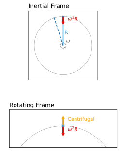

In the rotating frame, the object is not moving or accelerating, so we infer a centrifugal force that is equal and opposite to the centripetal force.

OK, but if I go skating, what is keeping me from flying away from the earth's axis of rotation?  The answer is that the force of gravity and the normal force from the ice are not exactly in the same direction (except at the equator).  If they were in the same direction, the earth would be a perfect sphere, but it is actually oblong, with the equatorial radius larger than the polar radius by about 21 km (if the earth spun faster this difference would be larger).  This means that everywhere on the planet, an average, the gravity force pulls in towards the axis of rotation slightly more than the normal force pushes outward, providing a net force that is directed inward towards the axis of rotation.

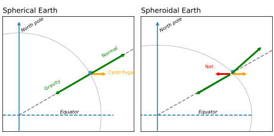

We don't usually talk about the centrifugal force because we define the geoid as the surface that the earth would be at so that it was in equilibrium with the gravity _and_ the centrifugal force.  Vertical is defined as perpendicular to the geoid, so the centrifugal force is already accounted for in the definition of vertical. Indeed if we were to hang a plumb bob it would not point towards the center of the earth, but rather is flung outwards slightly.

Note that you can get the value of g from a computer program, usually as a function of latitude as a first-order approximation.

## Coriolis force

The Coriolis force arises when a body is moving in a rotating frame of reference.  If we believe in the magic of vector calculus, it is quite trivial to show that the rate of change of a vector $d\mathbf{q}/dt$ observed in the inertial frame can be expressed in the rotating frame as
$$\frac{d\mathbf{q}}{dt} = \frac{\partial \mathbf{q}}{\partial t} + \mathbf{\Omega} \times \mathbf{q}$$
where $\mathbf{\Omega}$ is the angular velocity vector of the rotating frame.n  If we do this for the position vector $\mathbf{r}$, we have
$$\frac{d\mathbf{r}}{dt} = \frac{\partial \mathbf{r}}{\partial t} + \mathbf{\Omega} \times \mathbf{r}$$
If we take the time derivative of this equation, we have
$$ \frac{d^2\mathbf{r}}{dt^2} = \frac{d}{dt}\frac{\partial \mathbf{r}}{\partial t} + \Omega \times \frac{d \mathbf{r}}{dt} $$
We can use the transformation equation to write the first term in terms of things that are only observed in the rotating frame:
$$\frac{d}{dt}\frac{\partial \mathbf{r}}{\partial t} = \frac{\partial^2 \mathbf{r}}{\partial t^2} + \mathbf{\Omega} \times \frac{\partial \mathbf{r}}{\partial t}$$
and the second term is
$$\Omega \times \frac{d \mathbf{r}}{dt} = \Omega \times  \frac{\partial \mathbf{r}}{\partial t} + \mathbf{\Omega} \times \mathbf{\Omega} \times \mathbf{r}$$
So the total acceleration in the inertial frame is
$$\overbrace{\frac{d^2\mathbf{r}}{dt^2}}^{intertial} = \overbrace{\frac{\partial^2 \mathbf{r}}{\partial t^2}}^{rotating} + \overbrace{2 \mathbf{\Omega} \times \mathbf{u}}^{Coriolis} + \overbrace{\mathbf{\Omega} \times (\mathbf{\Omega} \times \mathbf{r})}^{centrifugal}$$
where $\mathbf{u} = \partial \mathbf{r}/\partial t$ is the velocity in the rotating frame.  The first term is the acceleration in the rotating frame, the second term is the Coriolis force, and the third term is the centrifugal force.

If you believe the first equation, the transformation is relatively straight forward, mathematically, but it is a bit harder to understand physically.  The basic reason is that if you try to move towards a target with a certain velocity, the target moves as it rotates, and you end up missing it.

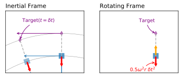

First, consider a person about to shoot a hockey puck away from the axis of rotation (so in the Northern Hemisphere, this would be to the south).  The puck initially has a slower tangential velocity than its target, and they both are being held in place by a centripetal force (red arrow) that balances a centrifugal force in the rotating frame (orange arrow).

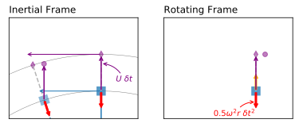

If the ball is thrown directly towards the target a distance $U\ \delta t$, both the target and the person shooting the puck will move $\omega R_T \delta t$ and $\omega R_S \delta t$ respectively, where $R_T>R_S$ is larger for the target than for the person shooting it.

When the puck is shot (purple dot), it is aimed at the target, and hence has a velocity component $U$ directly away from the axis of rotation (up in this diagram). It also still has its tangential velocity in the direction of rotation, but note that this tangential velocity is smaller than the target's tangential velocity.  The puck is also subjected to the centripetal force that the shooter was subjected to, so gets pulled towards the axis of rotation.  Adding these three components, the resulting vector is shown on the left side of the diagram, with the puck having moved around the circle, and been pushed "up".  The target has moved faster in the tangential direction, so the puck misses the target to the right.  In the rotating frame (right-hand panel), the puck appears to have been deflected to the right, and this is the Coriolis force.

Note that this adding of vectors really only applies for very short time intervals, and thinking about the target being very close to the shooter.  However, it is the idea behind the Coriolis force when the initial velocity is directed away or towards the axis of rotation.  Note that the only observable _force_ acting on the puck (after it is shot) is the centripetal force in the inertial frame.

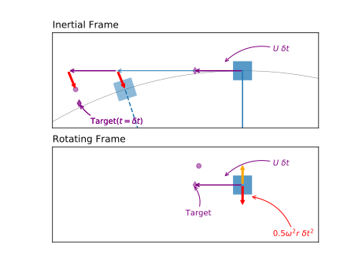

This only conceptualizes half the Coriolis effect. The puck will also be deflected to the right if it is shot tangential to the axis of rotation (eg east or west on the planet). Here we illustrate shooting the puck in the direction of rotation which would be towards the east in the Northern Hemisphere.  When the puck gets shot, it has a tangential component of velocity that the shooter has (blue arrow), a tangential velocity $U$ (purple arrow) that would get it to the target.  The puck is also subject to the centripetal force that the shooter was subjected to, pulling it towards the axis of rotation (red arrow).  The result is that the puck overshoots the target, and in the rotating frame appears to be deflected to the right.

One can do a little bit of geometry to prove to yourself that the strength of the force is consistent with the pictures given above, but the basic idea is that imparting a velocity to the puck takes it slightly out of equilibrium with the centripetal force, and the Coriolis force represents the tendency of the puck to either overshoot or fall behind the target.

## Inertial motions

We can now think about the motion of a puck on a rotating frame with a centripetal force acting on it to counterbalance the centrifugal force everywhere.  In the classroom, we can simulate this by having a ball on a turntable with a parabolic dish that has the right shape to provide a lateral force, or we can use a pendulum suspended at the axis of rotation that has a natural period that is equal to the rotation period of the turntable (we use the latter in class).  In the pendulum case, if the period of the turntable is $T$, the natural length of the pendulum is
$$L = \frac{g T^2}{4\pi^2} = g / \Omega^2$$
where $g$ is the acceleration due to gravity.  If the pendulum bob is a distance $R$ from the axis of rotation, the restoring force will be towards the axis of rotation and equal to:
$$F = -\frac{gm}{L} R\mathrm{\hat{r}}$$
where $m$ is the mass of the bob, and if we have chosen $L$ as above, we get that
$$F = \frac{g m}{g/\Omega^2} R\mathrm{\hat{r}} = -m \Omega^2 R\mathrm{\hat{r}}$$
Or that the pendulum can provide an inward for that is equal and opposite to the centrifugal force.  So it is possible for the bob to move in a circle following the rotation of the table, and in the rotating frame it will appear to be at rest.

If we give the bob an initial velocity in the rotating frame, it will no longer be in equilibrium with the centripetal force, and will not be able to stay on a circular path.  Instead it will trace out an ellipse in the inertial frame, distorted by the direction it was initially pushed.   This is shown below for the case where the initial push is with the rotation, against the rotation, towards the axis of rotation, and away, and finally at an angle that is both with the rotation and away from the axis. All initial velocities trace out an "intertial circle" in the rotating frame, and they all rotate by turning to the right.

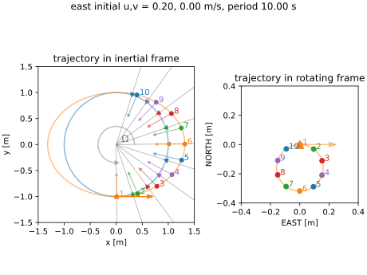
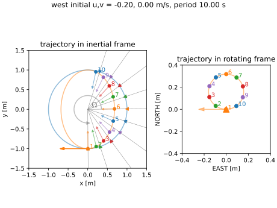
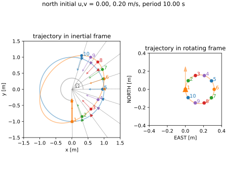
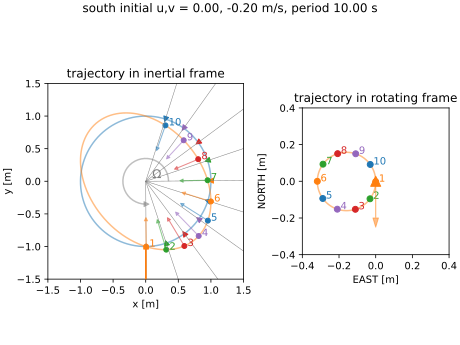
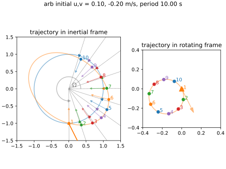

Take the first case, for instance, where the pendulum bob is pushed to the east, with the direction of rotation.  At the next time step (green) it has been pushed to the right of its resting point in the inertial frame (green triangle).  In the rotating frame, the bob has moved a bit to the east, but it has also moved further from the axis of rotation, which we identify as towards the south. As its pushed out, the bob is tracing a larger arc than the blue arc, and the blue arc catches up by time step 6.
At this point, the bob is still not moving fast enough to keep up, and falls behind, until the centripetal acceleration has had enough time to let it catch up again.

Mathematically, we write the inertial motion in the rotating frame
$$\frac{d^2\mathbf{r}}{dt^2} = + 2 \mathbf{\Omega} \times \frac{d\mathbf{r}}{dt}$$
Because $\mathbf{\Omega} = \Omega \hat{z}$, and we are only considering motions in the x-y plane (for now) we can write this as
$$ \frac{\partial^2 x}{\partial t^2} = 2 \Omega \frac{\partial y}{\partial t}$$
$$ \frac{\partial^2 y}{\partial t^2} = -2 \Omega \frac{\partial x}{\partial t}$$
where $x$ and $y$ are the coordinates in the rotating frame. Combining, we get:
$$ \frac{\partial^2 x}{\partial t^2} + \left(2 \Omega\right)^2 x = 0$$
and
$$ \frac{\partial^2 y}{\partial t^2} + \left(2 \Omega\right)^2 y = 0$$
These are the equations of motion for a simple harmonic oscillator, with a frequency of $2\Omega$.  The amplitude and phase of the oscillation depend on the initial velocity of the bob:
$$x(t) = A \sin(2\Omega t + \phi) + x_0$$
$$y(t) = A \cos(2\Omega t + \phi) + y_0$$
where $A$ is the amplitude of the oscillation, and $\phi$ is a phase, and $x_0$ and $y_0$ are horizontal offsets. We can solve for the initial conditions by setting $t=0$ and using the initial velocity:
$$ A = \frac{1}{2\Omega} \sqrt{u_0^2 + v_0^2}$$
$$ \phi = \arctan\left(\frac{-v_0}{u_0}\right)$$
$$x_0 = -A \sin(\phi)$$
$$y_0 = -A \cos(\phi)$$
where $u_0$ and $v_0$ are the initial velocities in the x and y directions respectively.
This of course traces out circles in the rotating frame, starting at the point $(x_0, y_0)$, and rotating counter-clockwise with a period of $T = \pi/\Omega$.

Inertial oscillations are important in the oceans, where there is a circular part to the response to a sudden wind.

- Show slide of inertial oscillations in the ocean

## Coriolis force on the earth

The Coriolis force on the (almost) spherical earth is fully three dimensional.  If we consider a co-ordinate system with $y$ pointing north, $x$ pointing east, and $z$ pointing up perpendicular to the geoid, the Coriolis force is given by:
$$2\mathbf{\Omega} \times \mathbf{u} = 2\Omega \left(\cos\lambda \hat{i} + \sin\lambda \hat{k}\right)\times \mathbf{u}$$
where $\lambda$ is the latitude.  We define $f(\lambda) = 2\Omega \sin\lambda$ as the _Coriolis parameter_, and $f^*(\lambda) = 2\Omega \cos\lambda$ as the _unconventional Coriolis parameter_.  The Coriolis force in the rotating frame is then a vector:
$$\mathbf{\Omega} \times \mathbf{u}  = \left(+vf, -uf+w f^*, -v f^* \right)$$
where $u$, $v$, and $w$ are the components of the velocity in the rotating frame.

In the ocean and atmosphere, the vertical velocity $w<<u,v$, so we can ignore the vertical component of the Coriolis force, and write the Coriolis force as:
$$\mathbf{F}_C \approx \left(+vf, -uf, 0\right)$$
Note that in the northern hemisphere, $f>0$, so the Coriolis force acts to the right of the velocity vector, and in the southern hemisphere, $f<0$, so it acts to the left of the velocity vector.

Note that $f=2\Omega \sin\lambda$ is zero at the equator, and increases to a maximum of $2\Omega$ at the poles. At $\lambda=\pm45^\circ$, $f=\pm10^{-4}\ \mathrm{rad\,s^{-1}}$.

# Full equations of motion

The full equations of motion in the rotating frame are therefore

$$\frac{\partial u}{\partial x} + \frac{\partial v}{\partial y} + \frac{\partial w}{\partial z} = 0$$
$$\frac{\partial u}{\partial t} + \mathbf{u}\cdot \nabla u = -\frac{1}{\rho}\frac{\partial P}{\partial x} + fv + \nu \nabla^2 u$$
$$\frac{\partial v}{\partial t} + \mathbf{u}\cdot \nabla v = -\frac{1}{\rho}\frac{\partial P}{\partial y} - fu + \nu \nabla^2 v$$
$$\frac{\partial w}{\partial t} + \mathbf{u}\cdot \nabla w = -\frac{1}{\rho}\frac{\partial P}{\partial z} -g + \nu \nabla^2 w$$
If we make the hydrostatic approximation the last equation simply becomes
$$\frac{\partial P}{\partial z} = -\rho g$$
Keep in mind that it is sometimes more convenient to express the stresses in terms of stresses, particularly if they are being used as boundary conditions like a wind stress at the ocean surface; eg. $\frac{1}{\rho}\tau_{xz} = \nu \frac{\partial u}{\partial z}$.

These equations are very hard to solve analytically - we can use a computer to solve them numerically (as you are doing in the assignments), or we can make some approximations to simplify them.

## Wind driven flow, no rotation

The wind is a very important driver of flows in the ocean.  Lets consider the simplest case, where the wind is uniform and steady, blowing in the x-direction, and that there is no rotation.  The water is $H$ deep, and the wind stress is known to be $\tau^W_x$.  There is no stratification (eg $\rho=\rho_0$ everywhere).

The steady state of such a flow is pretty trivial; the only terms that remain in the interior is
$$\nu \frac{\partial^2 u}{\partial z^2} = 0$$
or
$$u = A + B z$$
where $A$ and $B$ are constants.

We need to decide on the boundary conditions to solve this.  We said that the wind stress is $\tau^W_x$, so we can assume that the shear stress at the surface is the same:
$$\frac{\tau_{xz}}{\rho}\left(z=0\right) = \nu \frac{\partial u}{\partial z}|_{z=0} = \frac{\tau^W_x}{\rho}$$
This gives us a value for $B$:
$$B = \frac{\tau^W_x}{\nu \rho}$$

The other boundary condition can be parameterized various ways.  At a molecular level we usually assume that the velocity is zero at $z=-H$, so that gives
$$u = B\left(H+z\right) = \frac{\tau^W_x}{\nu \rho}\left(H+z\right)$$
This is a linear profile, with a slope that depends on the wind stress, the viscosity of the water, and the water depth.

As an example, a moderate wind stress observed in the ocean is about $0.1\ \mathrm{N\,m^{-2}}$, the viscosity of water is about $10^{-6}\ \mathrm{m^2\,s^{-1}}$, and the water depth is about $H=100\ \mathrm{m}$.  This gives a maximum velocity of
$$u(z=0) = 10^{+4}\ \mathrm{m\,s^{-1}}$$
which is unrealistically large.  What tends to happen in the real ocean is that there will be turbulent stresses in such a situation, so we replace $\nu$ with a turbulent viscosity that is much larger - perhaps $10^{-2}\ \mathrm{m^2\,s^{-1}}$.  This gives a maximum velocity of 1 m/s, which is still a very large velocity in the ocean, but not impossible.

We won't derive it here, but the timescale for this flow to develop from rest is about $H^2/\nu$.  For the molecular case, this is about $10^8\ \mathrm{s}$, or about 3 years.  For the turbulent case, it is about $10^6\ \mathrm{s}$, or about 11 days, which actually is quite slow compared to the observations of wind-driven upwelling on the coast.

Finally, note that we assume that the flow is zero at the seafloor.  This is not always practical to keep track of, so we often assume a boundary condition that specifies the stress near the sea floor as a function of the velocity in a drag law, eg $\mathbf{\tau}^B = -C_D\mathbf{u}\left|\mathbf{u}\right|$

# Balances with rotation

In geophysical fluid a large part of the flow can be described as a balance between the Coriolis force and either the pressure gradient force or the _vertical_ stresses:

$$\frac{Du}{Dt} = \underbrace{-\frac{1}{\rho}\frac{\partial P}{\partial x}  \phantom{ f v}}_{geostrophic} \overbrace{+fv +  \frac{1}{\rho}\frac{\partial \tau_{xz}}{\partial z}}^{Ekman}$$

$$\frac{Dv}{Dt} = \underbrace{-\frac{1}{\rho}\frac{\partial P}{\partial y}  \phantom{ f u}}_{geostrophic} \overbrace{-fu +  \frac{1}{\rho}\frac{\partial \tau_{yz}}{\partial z}}^{Ekman}$$

If either of these two balances dominate somewhere, then the accelerations can be neglected.

## Geostrophic balance:

The geostrophic balance assumes that the pressure gradient force is balanced by the Coriolis force.  This can be a very good approximation for large scale flows such as the ocean gyres or large scale atmospheric flows, and can give a first-order approximation of the flow from an estimate of the pressure field:
$$fv_g \approx \frac{1}{\rho}\frac{\partial P}{\partial x}$$
$$fu_g \approx -\frac{1}{\rho}\frac{\partial P}{\partial y}$$
where $u_g$ and $v_g$ are the geostrophic velocities in the x and y directions respectively.  The geostrophic velocity is perpendicular to the pressure gradient, and directed so that high pressure is to the right of the flow in the northern hemisphere ($f>0$).

Such flows are often also in hydrostatic balance, so if we know the sea surface height and have information about the density field, we can estimate the geostrophic flow.  Consider a flow with no density variations, and the sea-surface height varies linearly with $x$ as
$$\eta(x) = 10^{-7}\mathrm{m^{-1}}\ x $$
or 1 cm per 100 km. The pressure gradient force is then
$$\frac{1}{\rho}\frac{\partial P}{\partial x} = g\frac{\partial \eta}{\partial x} = 10^{-7}\mathrm{m^{-1}}\ g$$
and
$$v_g = 10^{-7}\mathrm{m^{-1}}\frac{g}{f}$$
If $f=10^{-4}\mathrm{rad\,s^{-1}}$, and $g\approx 10\ \mathrm{m\,s^{-2}}$, then
$$v_g = 10^{-7}\,\mathrm{m^{-1}}\frac{10\,\mathrm{m\,s^{-2}}}{10^{-4}\,\mathrm{rad\,s^{-1}}} = 10^{-2}\ \mathrm{m\,s^{-1}}$$

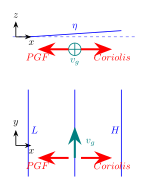

- show slide of gyre SSH:
  - flow goes clockwise subtropical gyre
  - faster flow in west.

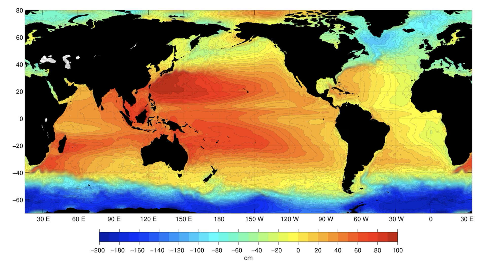

## Baroclinic geostrophic flow: "Dynamic height"

Before the satellite era, it was very difficult to get sea surface height on the scale of an ocean basin. However, it was possible to get temperature and salinity profiles from ships, and these could be used to estimate the density field, and hence calculate the pressure gradients due to the density gradients.  Recall:

$$-\frac{1}{\rho}\frac{\partial P}{\partial x} \approx \overbrace{- \frac{\partial \eta}{\partial x} g}^{barotropic} - \overbrace{\frac{g}{\rho_0}\int_z^0 \frac{\partial \rho}{\partial x} \,\mathrm{d}z}^{baroclinic}$$

The first term is due to the surface tilt, and the second is due to density gradients.

What was done historically was to calculate the _dynamic height_ relative to a reference level where the pressure gradient force is zero (and hence the geostrophic velocity is zero).  This reference level is often chosen to be 1000 or 2000 dbar, which was considered far enough away from the surface of the ocean that the geostrophic flow was negligible. The dynamic height is then defined as
$$\eta_D = C -\frac{1}{\rho_0}\int_{2000}^0 \rho \ \mathrm{d}z$$
where $C$ is an arbitrary constant, often chosen so that $\eta_D = 0$ at a reference position $(x, y)$.

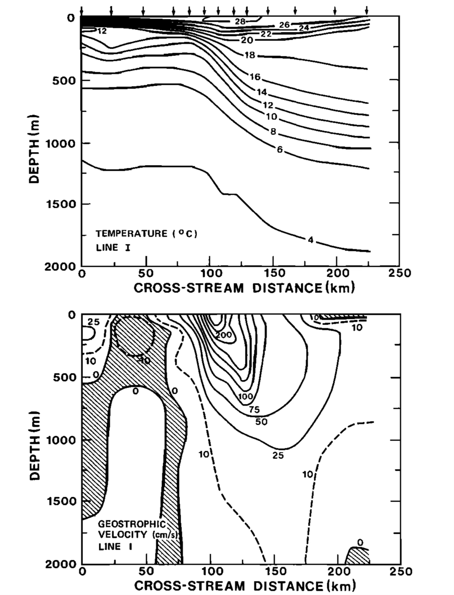

The data above is taken from the Gulf Stream.  The water is denser on the left (say at 50 km; note that colder temperatures are higher density) than on the right (say at 200 km). If we make it so $\eta_D=0$ at 50 km, then the dynamic height will be positive on the right over the lighter water.  Or in terms of pressure gradients, the baroclinic pressure gradient force is from left to right, so if there were no pressure gradient at 2000 m, there would need to be a barotropic pressure gradient from right to left to balance.

Note that there is still some baroclinic pressure gradient force at 2000 m; the _siotherms_ (contours of constant temperature, and hence density) are still sloping, so the dynamic height is still an approximation.

The flow of the Gulf stream is into the page and strongest at the surface  where the isopycnal tilts are the strongest (eg at 110 km), and decreases with depth (see bottom plot for the geostrophic velocity).

Again, before the satellite era, dynamic height was used to estimate the sea surface height using global ship surveys:

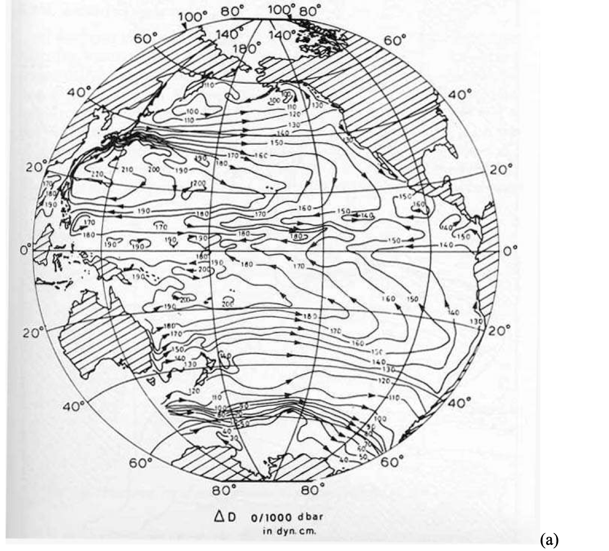

Compare to the satellite-derived seasurface height above, and the agreement is pretty good.

# Ekman Balance

The other balance is the _Ekman_ balance, where the Coriolis force is balanced by the divergence of the vertical stresses:
$$fv_{Ek} \approx -\frac{1}{\rho}\frac{\partial \tau_{xz}}{\partial z}$$
$$fu_{Ek} \approx \frac{1}{\rho}\frac{\partial \tau_{yz}}{\partial z}$$
We will write this in terms of the vertical shear in a minute, but this way of expressing the balance is more useful for understanding the Ekman layer.

Often we know, or can parameterize, the stresses at the surface and bottom of the ocean.  As in the above we may express $\tau^W_x$ at the sea surface, or we may know the bottom stress $\tau^B_x$ at the bottom of the ocean.  In this case, we can integrate the equations to get the two-dimensional transport perpendicular to the boundary stress, if we assume that at some distance far from the boundary the stress goes to zero.  So, for the case of a wind in the x-direction:
$$\int_{-H}^0 v_{Ek}\ \mathrm{d}z = -\frac{1}{f\rho}\tau^W_x + \frac{1}{f\rho}\tau_{xz}(-H) \approx -\frac{1}{f\rho}\tau^W_x $$
Similarly if the wind has a component in the y-direction:
$$\int_{-H}^0 u_{Ek}\ \mathrm{d}z = \frac{1}{f\rho}\tau^W_y - \frac{1}{f\rho}\tau_{yz}(-H) \approx \frac{1}{f\rho}\tau^W_y$$
The assumption that $\tau_{xz}(-H) \approx 0$ is not always true, but it is often a good approximation because the upper ocean tends to be quite turbulent compared to the interior.  Note that the transport has units of $\mathrm{m^2\,s^{-1}}$, and is the transport perpendicular to the wind stress per unit length in the direction of the wind stress.  This _Ekman transport_ is to the right of the wind stress.

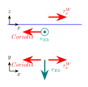

So considering the case above of $\tau^W_x = 0.1\ \mathrm{N\,m^{-2}}$, and $f=10^{-4}\ \mathrm{rad\,s^{-1}}$, we have
$$\int_{-H}^0 v_{Ek}\ \mathrm{d}z = -\frac{1}{f\rho}\tau^W_x = -\frac{0.1}{10^{-4}\cdot 1000} = -10\ \mathrm{m^2\,s^{-1}}$$
and the transport is to the south.  If we needed a 3-D transport, we would need a to multiply by a distance in the x-direction, say $L_x$.

Note that the same balance applies at the sea floor - if there is a bottom stress, there will tend to be an Ekman transport to the right of the bottom stress in the Ekman layer.

### Velocities within the Ekman layer

As an aside, and as motivation for the idea that the stress may be expected to go to zero far from the boundary, we can consider the Ekman equations:
$$fv_{Ek} = -\nu\frac{\partial^2 u_{Ek}}{\partial z^2}$$
$$fu_{Ek} = \nu\frac{\partial^2 v_{Ek}}{\partial z^2}$$
There are a number of ways to solve this, but if we define $\mathbf{u} = u_{Ek} + j v_{Ek}$, where $j=\sqrt{-1}$, we can write the equations as
$$j f \mathbf{u} = \nu \frac{\partial^2 \mathbf{u}}{\partial z^2}$$
This is a second-order ordinary differential equation, and we can solve it by assuming a solution of the form
$$\mathbf{u} = \mathbf{A} e^{\lambda z}$$
where $A$ and $\lambda$ are complex numbers.
Substitution into the equation means that
$$\lambda^2 =  \frac{f}{\nu} j$$
or
$$\lambda = \pm \sqrt{\frac{f}{2\nu}}(1+j)$$
The value $d_{Ek} = \sqrt{\frac{2\nu}{f}}$ is called the _Ekman depth_, and represents a decay scale of the solution.
The solutions is
$$\mathbf{u} = \mathbf{A} e^{(1+j) \frac{z}{d_{Ek}}} +\mathbf{B} e^{-(1+j) \frac{z}{d_{Ek}}} $$

Note that the second term solutions grow to infinity as $z\to -\infty$, so we can ignore it, and the solution is
$$\mathbf{u} = \mathbf{A} e^{(1+j) \frac{z}{d_{Ek}}}$$
The value of $\mathbf{A}$ is determined by the surface boundary condition, which is that the stress at the surface is equal to the wind stress:
$$\nu \frac{\partial \mathbf{u}}{\partial z}|_{z=0} = \mathbf{\tau}^W/\rho$$
where $\mathbf{\tau}^W = \tau^W_x + j \tau^W_y$ is the wind stress vector.  This gives:
$$\mathbf{A}(1+j) = \frac{d_{Ek} \mathbf{\tau}^W}{\rho \nu}$$
which breaking into real and imaginary parts gives:
$$ a-b = \frac{d_{Ek} \tau^W_x}{\rho \nu}$$
$$ a+b = \frac{d_{Ek} \tau^W_y}{\rho \nu}$$
where $A = a + j b$.

So, if for instance, $\tau^W_y = 0$ then $a=-b$ and
$$a = -b = \frac{d_{Ek} \tau^W_x}{2\rho \nu}$$
Writing the solution out we get the slightly complicated:
$$u(z) = a \left(\cos(z/d_{Ek}) + \sin(z/d_{Ek}) \right)e^{z/d_{Ek}}$$
$$v(z) = a \left(-\cos(z/d_{Ek}) + \sin(z/d_{Ek}) \right)e^{z/d_{Ek}}$$
This traces out a spiral in the $u-v$ plane with depth, with a decay scale of $d_{Ek}$, and a wavelength of $2\pi d_{Ek}$.  The surface velocity is to the right of the wind at exactly an angle of 45 degrees (to the left in the southern hemisphere) Note that the solution is the same for any initial wind stress direction.

Finally, note that the velocity decays with depth, validating our assumption that the shear stresses go to zero.

The reason that this is an aside, is that for the dynamics we are interested in, it is the _transport_ that is important, not the structure of the velocities in the mixed layer.  And we have assumed a constant viscosity $\nu$, which is fine for a laminar fluid, but in a turbulent ocean would be replaced by a turbulent viscosity that is not likely to be constant and may affected by stratification.  Indeed observed Ekman spirals tend to be substantially different than this simple theory (see below).  However, the observed transport is found to be consistent with the overall Ekman balance.

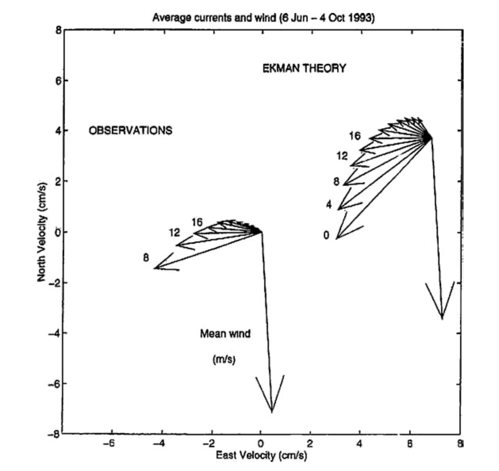

## Ekman and geostrophic balance in a channel

Between them, the Ekman balance and the geostrophic balance can explain a lot of the flow in the ocean.  Lets consider a simple case of a channel in the x-direction with a depth that is large enough that there is a region between the surface ocean and the sea floor where the stresses are weak, and at a latitude where the Corilis parameter is $f$, with a wind stress $\tau^W_x$ at the surface.  Let's parameterize the bottom stress as $\tau^B_x = C_D \rho_0 U^2$, where $C_D$ is a drag coefficient, and $U$ is the velocity near the bottom of the channel (but _not_ the Ekman velocity). Suppose the channel starts are rest, and the wind stress is turned on at $t=0$.

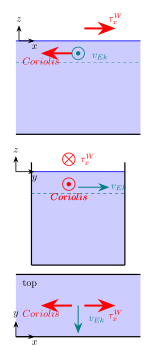

_Initially_ the flow will be down wind in a very thin layer at the surface.  However, the Ekman layer will develop within an inertial period, and soon the flow will be southward in balance with the wind.  This southward flow will be _everywhere_ in the channel, and what will immediately start happening is that water will be removed from the north side and pile up on the south side. This creates a pressure gradient force from south to north that will come into balance with an equal and opposite Coriolis force, which means that there will be a flow towards the east, in the positive x direction.

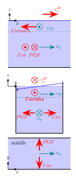

While this is happening, the Ekman layer is continuing to pile water up in the south, increasing the interior pressure gradient.  This doesn't stop until there is a return flow from north to south somewhere.  THis happens in the bottom Ekman layer.  Remember that we will parameterize bottom stress as opposite to the mean flow.  This means that there will be a bottom drag $\tau^B_x$ towards the west (negative x-direction).  If there is a bottom Ekman layer in balance with this bottom stress, the Coriolis force must be to the east and the water is moving north $v_{Ek}$ on average.

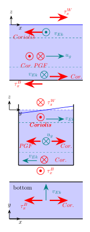

These three layers of flow will come to steady state when the transport in the bottom Ekman layer is equal and opposite the transport in the surface Ekman layer. Since the transport is $\int_{-d_{Ek}}^0 v_{Ek}\ \mathrm{d}z = \frac{\tau^W_x}{f\rho} = - \int_{-H}^{-H+d_{Ek}}v_{Ek}\,\mathrm{d}z = -\frac{\tau^B_x}{f\rho}$, we can see trivially that $\tau^B_x = -\tau^W_x$.  This equivalence of the two stresses should be apparent from the fact that overall the flow will not be in steady state until there is just as strong a force on the water to oppose the wind.

Note that this flow implies an overturning circulation

Given this, we can predict how fast the flow in the channel is, if we believe that the bottom stress is given by a quadratic drag law:
$$\tau^B_x = -C_D \rho_0 u_g\left|u_g\right|$$
The drag coefficient is determined empirically and can vary depending on the seafloor composition and roughness, but is often about $10^{-3}$ (and note it is dimensionless).  Given the wind stress of $\tau^W_x = 0.1\ \mathrm{N\,m^{-2}}$, we can can get $u_g\approx 0.1\ \mathrm{m\,s^{-1}}$.
This is a reasonable speed for a current in the ocean.  We can further estimate the seasurface tilt necessary to keep this geostrophic flow in balance with the Coriolis force:
$$g \frac{\partial \eta}{\partial y} = - f u_g$$
so in this case $\frac{d\eta}{dy} \approx 10^{-3}\mathrm{m\,km^{-1}}$, or over a 10 km wide channel the seasurface tilt would only be 1 cm.

### Timescales

The timescales for a wind-driven circulation are _much_ faster when there is rotation and Ekman layers.  The Ekman layers are relatively thin - for $f=10^{-4}\ \mathrm{rad\,s^{-1}}$ and a turbulence viscosity of  $\nu_T=10^{-2}\ \mathrm{m^2\,s^{-1}}$, the Ekman depth is about $15\ \mathrm{m}$.  The time scale for the diffusion of momentum through the Ekman layer is
$$t \sim \frac{d_{Ek}^2}{\nu_T} = 2 / f \approx 4\pi\cdot 10^4\ \mathrm{s}$$
or about 36 h, which is much faster than if it had to diffuse through the whole water column ($t\approx 10^6 \mathrm{s}$ if water 100 m deep).

Similarly, if the Ekman layer is transporting $10\ \mathrm{m^2\,s^{-1}}$ of water to the south, it does not take much time at all to set up the 1-cm scale sea surface tilt once the Ekman transport is established.  The convegence at the southern wall propagates across the channel as a surface wave which has speeds $\sqrt(gH) \approx 30\ \mathrm{m\,s^{-1}}$ in 100 m of water.

## Compare to observations:

Show all this happening in the coastal upwelling case using Perlin et al slides.

- note the baroclinic pressure gradient means that the net flow is stronger and the sea-surface tilt is larger than if the flow were barotropic.

