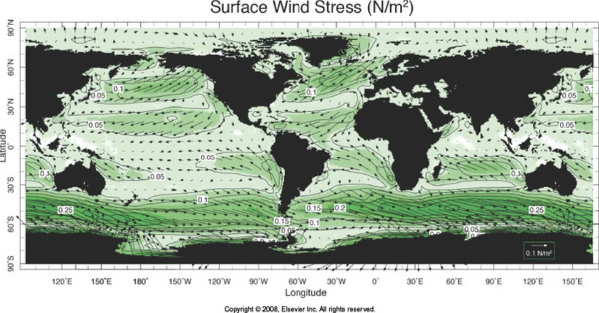
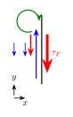

# Gyre circulation:

## Qualitative description of the gyre circulation

Consider the North Pacific again.  There is a sealevel high between 15 and 45 degrees N, and a relative low north of this.  The high is what is called the _subtropical gyre_, and implies clockwise circulation if the flow is in geostrophic balance.  Note that the flow is not symmetrical, with $|\partial\eta/\partial x|$ being much larger on the west side of the basin than the east.  This sharp gradient in sea surface height is the Kuroshio; the corresponding current in the Atlantic is the Gulf Stream and can be see on the west side of the Atlantic basin at approximately the same latitude.   Note that these same features are mirrored in the Southern Hemisphere, but keep in mind that the flow is counter-clockwise there.

It is a trivial exercise to calculate the geostrophic velocities from these sea-level heights:

$$\mathbf{u} = \frac{1}{f\rho}\nabla \times P\hat{k} = \frac{g}{f}\nabla \times \eta\hat{k} $$

That is actually hard to look at, so we usually consider a _streamfunction_ $\frac{\partial \psi}{\partial y}= u$ and $\frac{\partial \psi}{\partial x} = -v$ where $\psi$ is the streamfunction.  Note that $\mathbf{u}\times\nabla \psi = 0$ so the velocity vectors are parallel to contours of $\psi$ everywhere, and in steady state, a particle will follow contours of $\psi$.  Also note that the closer the streamlines are to each other, the faster the flow.

Of course, under this definition, the seasurface height in geostrophic balance is the stream function scaled by:
$$\psi = \frac{g\eta}{f} + \psi_0$$
where $\psi_0$ is a constant of integration that can be set by the boundary conditions.  The streamfunction is not unique, but the gradients are.
The change in the stream function multiplied by the section width gives the transport across that section.  If we look above, a section across the Kuroshio may give a $\delta \eta \approx 0.6 \mathrm{m}$ over 100 km,  so $\delta \psi \delta x = = 0.6 \mathrm{m} \times 100 \mathrm{km} \times 9.8 \mathrm{m^2\,s^{-1}} / 10^{-4}\ \mathrm{rad\,s^{-1}} = 5.8\times 10^7 \mathrm{m^3\,s^{-1}}$.

The unit of transport $10^6\ \mathrm{m^3\,s^{-1}}$ is called a  _Sverdrup_ ($\mathrm{Sv}$) after Harald Sverdrup, who was one of the first to study the gyre circulation in the North Atlantic.  So we write the transport in the Kuroshio as approximately $60\ \mathrm{Sv}$.

The wind is almost entirely responsible for this flow.  The North Pacific, the wind stress has trade winds blowing from east to west, centered at approximately 15 degrees N, and the westerlies blowing from west to east at approximately 45 degrees N.  Similar winds are in the Atlantic and the Southern Hemisphere, though the Westerlies in the Southern Hemisphere are much stronger primarily because there is no land there. Note that these winds are somewhat in agreement with the gyre circulation shown above, with flow from west to east at about 45 N and east to west at about 15 N.  However, there is nothing really to explain the _westward intensification_ of the gyre, and it would be nice to have a theory to explain the 60 Sv strength of the transport in the subtropical gyre.

## Ekman convergence and divergences

As noted in the previous section, the Ekman transport is to the right of the wind stress (in the northern hemisphere).  We saw that if there is a wall to the right of the wind, water will accumulate there and the sea surface will tilt.  Similarly, if there is a wall to the left, there will be a divergence of the Ekman transport.

Of course the same thing happens if there is a gradient in the wind stress.  Consider a wind stress in the x direction, but the wind increases to the north (eg $\partial \tau^W_x/\partial y > 0$).  The Ekman transport will be everywhere to the south, but it will be larger in the north than in the south.  This means that there will be a convergence of the Ekman transport, and water will accumulate there creating a local high in the sea surface.

This high cannot continually accumulate, so eventually the water is pushed downwards, creating what we call Ekman ``pumping'' or ``downwelling''.  The convergence of the Ekman flow is very important for setting the sea- surface height gradients in the ocean, and for pumping water from the surface to the interior, or vice-versa when the gradient is in the opposite direction.

We can calculate the strength of the Ekman downwelling by considering the continuity eqaution
$$\frac{\partial u}{\partial x} + \frac{\partial v}{\partial y} + \frac{\partial w}{\partial z} = 0$$
If we integrate this vertically across the Ekman layer, we get:
$$\frac{\partial}{\partial x} \int_{-d_{Ek}}^{0} u \, dz + \frac{\partial}{\partial y} \int_{-d_{Ek}}^{0} v \, dz + \frac{\partial}{\partial z} \int_{-d_{Ek}}^{0} w \, dz = 0$$
We showed above that the first two terms are related to the wind stresses, so we have:
$$w(d_{Ek}) = \frac{1}{\rho}\frac{\partial \tau^W_y}{\partial x} - \frac{1}{\rho}\frac{\partial \tau^W_x}{\partial y} + w(0)$$
or, because the sea surface can't keep going up in steady state:
$$w(d_{Ek}) = \frac{1}{\rho}\nabla_H \times \mathbf{\tau}^W$$
which is the horizontal curl of the wind stress vector.

Note that in the example above $\nabla_H \times \mathbf{\tau}^W$ is negative, so the vertical Ekman velocity $w_{Ek}$ is negative (downwelling).  The arrangements of the arrows doesn't matter and it there are definitely cases where the wind stress curl is positive and there is Ekman suction, or ``upwelling''.

Hopefully the above gives is some insight into why there is a sea surface high between 15 and 45 N.  The Westerlies transport water south from 45 N, and the Trades transport water north from 15 N, and the water converges in the middle.  It does not explain the westward intensification of the gyre, and it does not give a reliable prediction of the strength of the gyre.  Indeed, if we only had constant $f$ and wind forcing, the gyre circulation would be symmetric and heavily dependent on how the bottom stress is parameterized since that would be the only place to dissipate energy in the system.

## Conservation of potential vorticity

For large scale flows on a rotating planet, the conservation of ``potential vorticity'' is a very useful way to understand the flow.  This concept is directly analagous to the conservation of angular momentum for solid bodies, but is complicated by the fact that the Earth is rotating, so even fluids at rest have non-zero angular momentum.  This leads to some interesting effects, and can be used to make powerful inferences about gyre circulations.

Vorticity equations are formed by taking the curl of the momentum equation.  It is easiest to start with the shallow-water equations, discussed above when talking about surface waves:

$$\frac{\partial u}{\partial t} + \mathbf{u}\cdot\nabla u -fv = -\frac{1}{\rho}\frac{\partial P}{\partial x} + \nabla \mathbf{\tau_x}$$
$$\frac{\partial v}{\partial t} + \mathbf{u}\cdot\nabla v +fu = -\frac{1}{\rho}\frac{\partial P}{\partial y} + \nabla \mathbf{\tau_y}$$

where $\mathbf{u}$ is the horizontal velocity, $f$ is the Coriolis parameter, $\hat{k}$ is the vertical unit vector, $P$ is the pressure. $\mathbf{\tau_x}=(\tau_{xx}, \tau_{xy}, \tau_{xz})$ are the x-direction shear stresses, and $\mathbf{\tau_y}$ are the y-direction shear stresses.
The continuity equation also integrates to:
$$\frac{\partial \eta}{\partial t} + \nabla\cdot(\left(\eta+h\right)\mathbf{u}) = 0$$
where $\eta$ is the sea surface height, and $h = h(x,y)$ is the depth for the water, but note that we are not assuming constant depth.

The vertical vorticity component is defined as $\zeta = \frac{\partial v}{\partial x} - \frac{\partial u}{\partial y}$, so we can use the x- and y-momentum equations to say
$$\frac{\partial \zeta}{\partial t} - f \left(\frac{\partial u}{\partial x}  + \frac{\partial v}{\partial y} \right) + v \frac{df}{dy} - \frac{\partial}{\partial y}\left(\mathbf{u}\cdot\nabla u\right) + \frac{\partial}{\partial x}\left(\mathbf{u}\cdot\nabla v\right) = \nabla\cdot\left(\frac{\partial}{\partial x}\mathbf{\tau_y} - \frac{\partial}{\partial y}\mathbf{\tau_x} \right)$$
The second to last and last terms on the left-hand side expand to 8 total terms, and by carefully re-arranging, we can write as:
$$\frac{\partial \zeta}{\partial t} + \mathbf{u}\cdot\nabla \zeta + \left(\zeta+f\right)\left(\frac{\partial u}{\partial x} + \frac{\partial v}{\partial y}\right) + v \frac{df}{dy} = \nabla\cdot\mathbf{T}$$
where we have defined $\mathbf{T} = \frac{\partial}{\partial x}\mathbf{\tau_y} - \frac{\partial}{\partial y}\mathbf{\tau_x}$ as a stress torque term, discussed below.
Note that the first two terms are just the material derivative, and also note that $Df/dt = v\frac{df}{dy}$, and we can write as
$$\frac{D}{Dt}\left(\zeta + f\right) + \left(\zeta+f\right)\left(\frac{\partial u}{\partial x} + \frac{\partial v}{\partial y}\right) = \nabla\cdot\mathbf{T}$$
So the material derivative of $\zeta+f$ is subject to diffusion, and a term that is proportional to the divergence of the flow.  $\zeta$ is the vorticity of the water, and has to do with it's local tendency to spin.  $f$ is the Coriolis parameter, which can be thought of as the vorticity imparted by the rotation of the Earth, and so we refer to this as the _planetary vorticity_.

The continuity equation can now be used to write the divergence term as:
$$-\left(\eta + h\right)\left(\frac{\partial u}{\partial x} + \frac{\partial v}{\partial y}\right) = \frac{D}{Dt}\left(\eta + h\right)$$
and into the vorticity equation we get:
$$\frac{D}{Dt}\left(\frac{\zeta + f}{\eta + h}\right) = \left(\eta + h\right)^{-1}\nabla\cdot \mathbf{T}$$
The term $\frac{\zeta + f}{\eta + h}$ is called the _potential vorticity_ and is conserved in the absence of stress torques.  The stress torque term $\mathbf{T}$ is the divergence of the stress tensor, and is a measure of the tendency of the flow to spin up or down.  If there are no stress torques, then potential vorticity is conserved.

### Eg: Parcel spinup

For example, consider a column of water on a rounded seamount that then is initially not in motion (in the Earth's rotating frame of reference).
In the absence of a stress torque, and assuming $\eta << h$, the conservation of potential vorticity simplifies to
$$\frac{D}{Dt}\left(\frac{\zeta + f}{h}\right) = 0$$
or following a parcel of water
$$\frac{\zeta_F + f_F}{h_F} = \frac{\zeta_I + f_I}{h_I}$$
where the subscripts $F$ and $I$ refer to the final and initial states of the parcel.  If we assume the water doesn't change $f$ and $\zeta_I$ is zero, then we have
$$\zeta_F=\left(\frac{h_F}{h_I}-1\right)f$$
and since $h_F>h_I$ the final _relative_ vorticity of the parcel is greater than zero.  Note this is analgous to a skater movig their arms towards their axis of rotation and spinning faster, except in this case the water is converting _planetary_ vorticity into _relative_ vorticity.  This is a very important process in the ocean, and is responsible for the formation of eddies and other features in the ocean.

### The tendency of flow to move towards a region where $\zeta=0$

Suppose we have a parcel of water that has a relative vorticity $\zeta_I$, at depth $h_I$ and latitude where the Coriolis parameter is $f_I$.  Eddies in the ocean tend to move towards regions where the relative vorticity tends to zero, so we can write
$$\frac{f_F}{h_F} = \frac{\zeta_I + f_I}{h_I}$$
So if $\zeta_I>0$, then $f_F/h_F > f_I/h_I$.  On a slope this means that the eddy will tend to move towards a region where $h_f<h_I$; eg towards shallower water.  Conversely, if it is a flat bottom ocean, the eddy will tend to move towards higher latitudes where $f_F>f_I$.

An example of this in the Atmosphere is the propagation of Hurricanes.  These as cyclones, driven by vortext stretching of planetary vorticity: eg, in the above $h_F>$h_I$ so the air parcel gains $\zeta_F>0$.  After forming, the hurricanes tend to move poleward, where the Coriolis parameter is larger, and lose their relative vorticity.  Cyclones tend to move west as well, though the mean winds strongly influence their paths.

The same dynamics apply to eddies in the ocean.  Cyclonic eddies propagate poleward (in both hemispheres) and anticyclonic eddies propagate equatorward.  Again these tendencies can be affected byu the mean flow, but averaged through the ocean, this tends to be the case. Eddies in both hemispheres tend to propagate westward, and this is called the _beta drift_ of the eddies, and is related to the propagation of Rossby waves (discussed later)

## Sverdrup Transport and return flow

On a large scale, the gyre circulation is driven by wind stress curl.  The relative vorticity $|\zeta| \ll |f|$ except temporarily in very limited regions.  We can check this by considering the speed of the flow in the Kuroshio or Gulf Stream which can reach $v\approx2 m/s$, and it varies over maybe $\delta x \approx 100 km$, so the relative vorticity in these regions is $2\times10^{-5}\ \mathrm{s^{-1}}$.  The Coriolis parameter at 30 N is $f\approx10^{-4}\ \mathrm{s^{-1}}$, so the relative vorticity is about 5 times larger than the planetary vorticity.  Across the rest of the gyre, the velocity scale is the same, but the gyre is $10^4\mathrm{km}$ across, so the relative vorticity is $10^{-9}\ \mathrm{s^{-1}}$, which is negligible compared to the planetary vorticity.

We can indeed define a number that represents the relative importance of the relative vorticity to the planetary vorticity, and this is called the _Rossby number_:
$$Ro = \frac{U}{L|f|}$$
So for the gyre, the Ro is about $10^{-1}$ to $10^{-5}$.  For a typical mesoscale eddy, $Ro\approx 1$.

So, for low-Rossyb number flows we can write the vorticity equation as:
$$\frac{D}{Dt}\left(\frac{f}{\eta + h}\right) = \left(\eta + h\right)^{-1}\nabla\cdot \mathbf{T}$$
There are two equivalent ways to go from here - one is to integrate this equation vertically, and the other is to consider the stresses as just acting on the Ekman layer (as before), and the interior responding to Ekman upwelling or downwelling.

### Surface wind stress torquing the fluid

Lets not think about upwelling or downwelling, and lets consider $h$ to be constant constant, and $\eta \ll h$. The vorticity equation is even simpler:
$$\frac{Df}{Dt} = \nabla \cdot \mathbf{T}$$
If we also only consider the surface wind stress propagating in the vertical, then the stress divergence is
$$\nabla \cdot \mathbf{T} = \frac{\partial}{\partial z}\left(\frac{\partial}{\partial x}\tau_y - \frac{\partial}{\partial y}\tau_x\right)$$
Then we can integrate the vorticity equation vertically to get:

$$h\frac{Df}{Dt} = \frac{1}{\rho}\left(\overbrace{\frac{\partial}{\partial x}\tau^W_y - \frac{\partial}{\partial y}\tau^W_x}^{\text{wind stress}} + \overbrace{\frac{\partial}{\partial x}\tau^B_y - \frac{\partial}{\partial y}\tau^By}^{\text{bottom stress}}\right)$$
Wind driven currents tend to be surface intensified because of the stratification of the ocean, so we can neglect the bottom stress.  And $\frac{Df}{Dt} = \frac{\partial f}{\partial t} + \mathbf{u}\cdot\nabla f = v\frac{\mathrm{d}f}{\mathrm{d}y}$, so we can write the vorticity equation as:
$$hv\frac{\mathrm{d}f}{\mathrm{d}y} = \frac{1}{\rho}\left(\frac{\partial}{\partial x}\tau^W_y - \frac{\partial}{\partial y}\tau^W_x\right)$$
And of course we know $\frac{\mathrm{d}f}{\mathrm{d}y} = 2\Omega \cos\phi\frac{d\phi}{dy}=2.3\times10^{-11} \mathrm{(ms)^{-1}} \cos \phi$. We define $\beta \equiv \frac{\mathrm{d}f}{\mathrm{d}y} \approx 1.6\times10^{-11} \mathrm{(ms)^{-1}}$ at 45 N.  Note that $\beta$ is always positive from $\phi=-pi/2$ to $\phi=pi/2$, because the Coriolis parameter increases with latitude.

This means that the 2-dimensional _Sverdrup transport_ is given by
$$vh = \frac{1}{\rho \beta}\left(\frac{\partial}{\partial x}\tau^W_y - \frac{\partial}{\partial y}\tau^W_x\right)$$
with units of $\mathrm{m^2\,s^{-1}}$ per distance in the x direction.

If we go back to the gyre circulation, we can see that the wind stress curl is negative in the subtropical gyre, so the Sverdrup transport is negative, and the flow is to the south.  We can get an idea for how strong this flow is by inspection of the wind stress field.  $\delta \tau^W_x \approx 0.1 \mathrm{N\,m^{-2}}$ over $\delta y \approx 3,300\ \mathrm{km}$, so the Sverdrup transport is approximately

$$vh \approx \frac{1}{\rho \beta}\left(\frac{\partial}{\partial x}\tau^W_y - \frac{\partial}{\partial y}\tau^W_x\right) \approx \frac{1}{1025\ \mathrm{kg\,m^{-3}} \times 1.6\times10^{-11} \mathrm{(ms)^{-1}}}\left(\frac{0.2\ \mathrm{N\,m^{-2}}}{3300\ \mathrm{km}}\right)\approx 3.8\ \mathrm{m^2s^{-1}}$$

Integrated across the gyre $\delta x \approx 1.4\times10^4\ \mathrm{km}$, this gives a transport of approximately $53\times 10^6\ \mathrm{m^3\,s^{-1}}=53\ \mathrm{Sv}$.  This is actually a slight underestimate due to not getting the curvature of $-\frac{\partial \tau^W_x}{\partial y}$ exactly right, but it is in the right ballpark.

The correct way to do this is to calculate the wind stress curl.  So if we assign a sinusoid to the wind stress, we get $\tau_x^W = 0.1\ \mathrm{N\,m^{-2}} \sin\left(2\pi \frac{y-y_{30}}{6600\ \mathrm{km}}\right)$, then the Sverdrup transport is
$$vh = -\frac{1}{1025\ \mathrm{kg\,m^{-3}} \times 1.6\times10^{-11} \mathrm{(ms)^{-1}}}\left(2\pi \frac{0.1\ \mathrm{N\,m^{-2}}}{6600\ \mathrm{km}}\cos\left(2\pi \frac{y-y_{30}}{6600\ \mathrm{km}}\right)\right)$$
or
$$vh = \left(-58 \ \mathrm{Sv}\right)\  \cos\left(2\pi \frac{y-y_{30}}{6600\ \mathrm{km}} \right)$$
Note that this is in _very_ good agreement with other estimates.

### Surface wind stress creating upwelling and downwelling.

A complimentary way of thinking about the Sverdrup transport is that there is a frictional surface Ekman layer.  Recall that the Ekman upwellin/downwelling is given by
$$w_{Ek} = \frac{1}{f\rho}\nabla_H \times \mathbf{\tau}^W$$
where $\nabla_H$ is the horizontal gradient operator.  This of course is the same term that appears in the torque term above, except now we consider that the Ekman downwelling  in sthe subtropical gyres is causing $\frac{Dh}{Dt} <0$, and hence the water wants to move south.  By conservation of potential vorticity with no friction:
$$\frac{D}{Dt}\left(\frac{f}{h}\right) = -\frac{f}{h^2}\frac{Dh}{Dt} + \frac{1}{h}\frac{Df}{Dt} = 0$$
or
$$vh = \frac{f}{\beta}\frac{Dh}{Dt}= \frac{f}{\beta}w_{Ek} = \frac{1}{\rho \beta}\left(\frac{\partial}{\partial x}\tau^W_y - \frac{\partial}{\partial y}\tau^W_x\right)$$
which is just the same as the Sverdrup transport above.

The idea behind this is useful for thinking about how the Sverdrup transport arises.  There is an Ekman convergence under the negative wind stress curl.  This pushes the water below down, and it develops some slight negative relative vorticity that then is balanced by propagaing towards the equator where the Coriolis parameter is smaller.

## Return flow and east/west motions

### necessity of a western boundary current

In the example of the subtropical gyre, used here, the wind torque is negative, so the net transport is everywhere towards the south. This accords with the observations in the bulk of the gyre, but clearly violates conservation of mass if this were the only flow.  Water has to return to the north somewhere as a _return flow_.

This return flow has to involve friction on the flow somehow, and in this problem we have either bottom friction, or sidewall friction (note in the real ocean it is all bottom friction, but in our idealized box bottom friction on a sloping sidewall can be thought of as lateral friction).  Lets consider lateral friction first, and assume that there is a boundary current going to the north, either along the east wall or the west wall.

If the return flow were to be along the east wall, then there would be a strong friction force pushing the water southward, opposing the northward flow.  However this exerts a negative (clockwise) torque on the water.  Under Sverdrup dynamics that would mean the torque would work against the return flow.  Alternatively, it means that a strong sidewall friction to the east does not have a positive torque to overcome the negative torque from the wind stress curl.

Conversely, a return flow on the west wall has the opposite torque due to the sidewall friction.  A strong flow to the north generates a strong friction to the south, to the left of the current, and this generates a positive (counter-clockwise) torque on the water.  Under Sverdrup dynamics, this means that the return flow has a torque that does not oppose itself, and the water can continue to flow north.  Alternatively, we can think of the sidewall friction as providing a positive torque that balances the negative torque from the wind stress curl.

So the return flow in the gyre is always along the west wall, and this is called the _western boundary current_.  In the North Pacific, this is the Kuroshio, and in the North Atlantic it is the Gulf Stream.  In the Southern Hemisphere, it is the East Australian Current and the Brazil Current.  The scan be clearly seen in the sea surface height maps above, and is a very important part of the gyre circulation.

Note that the same torque logic applies if we want to consider bottom friction opposing the return flow instead of lateral friction.  On the eastern boundary a strong return flow will generate a stronger friction to the south along the east side, and a weak friction to the north to the west, leading to a negative torque, just like the lateral friction case; the same logic applies for a western boundary return flow, except now the frictional torque is positive.

### Total flow

The Sverdrup dynamics only allows us to deduce the strength of north-south transports.  We can deduce the east west transports from continuity, or by defining a transport stream function:
$$\partial \psi/\partial x = -vh$$
Which we can integrate in x to get the transport stream function:
$$\psi(x, y) = -\int_0^x vh \, \mathrm{d}x = -vh x + \psi(0, y)$$
We also know that $\psi(L, y)$ is a constant along the eastern wall, because the wall is a streamline, or because $\partial \psi / \partial y = uh =0$ there.  So this means that
$$\psi(x, y) = -vh(L-x) = +\frac{(L-x)}{\rho_0\beta}\frac{\partial \tau^W_x}{\partial y}  $$
where $\psi(0, y)$ is a constant of integration that can be set by the boundary conditions.

The circulation is, of course, closed by the western boundary current we argued for in the section above.

### More complete solution

A more complete solution can be derived if we determine a form of the botton friction.  Suppose $\tau^B = -\rho_0 k \mathbf{u}$, where $k$ is a _linear_ friction coefficient with units of $\mathrm{m\,s^{1}}$ (Note: previously we used a quadratic friction co-efficient, but that makes the math much harder, and this is the same idea).   Then the vorticity equation becomes:
$$vh = \frac{1}{\rho_0\beta}\left(\frac{\partial}{\partial x}\tau^W_y - \frac{\partial}{\partial y}\tau^W_x - \rho_0k\frac{\partial v}{\partial x} + \rho_0k\frac{\partial u}{\partial y}\right)$$
In the interior, the bottom friction terms are negligible, and we have the solution as before.  In the western boundary current the x-dreviative is much larger than the y-derivative, so we can write $v=v_S+v_W$ where $v_S$ is the velocity due to the wind torque and $v_W$ is the anomally in the western boundary current.
$$v_Wh = \frac{-k}{\beta}\frac{\partial v_W}{\partial x}$$
This gives
$$v_Wh = A(y)\exp\left(-\frac{\beta h}{k}x\right)$$
and integrating across the basin determines the constant $A(y)$:
$$A(y) \approx -v_S(y) h \frac{L \beta h}{k}$$
if $L>>\frac{\rho_0\beta}{k}$.
So the total flow is
$$vh = v_Sh\left(1 - \frac{L\beta h}{k}\exp \left(-\frac{\beta h}{k} x\right)\right)$$

Note that the width of the western boundary current depends on the linear friction coefficient $k$, with smaller values of $k$ leading to a narrower and more intense current, and larger values leading to a wider and weaker current.

We can again write in terms of a stream function:
$$\psi(x,y) = v_S(y)h\left[x - L\left( 1 - \exp \left(-\frac{\beta h}{k}x\right)\right) \right]$$

Note that the lateral scale of the western boundary current is $k/\beta h$, which if we think the Kuroshio is about 200 km wide. $\beta \approx 1.6\times10^{-11}\ \mathrm{(ms)^{-1}}$, and $h\approx 1,000\ \mathrm{m}$, so $k\approx 3.2\times10^{-3}\ \mathrm{m\,s^{-1}}$ is a reasonable value for the linear friction coefficient.

