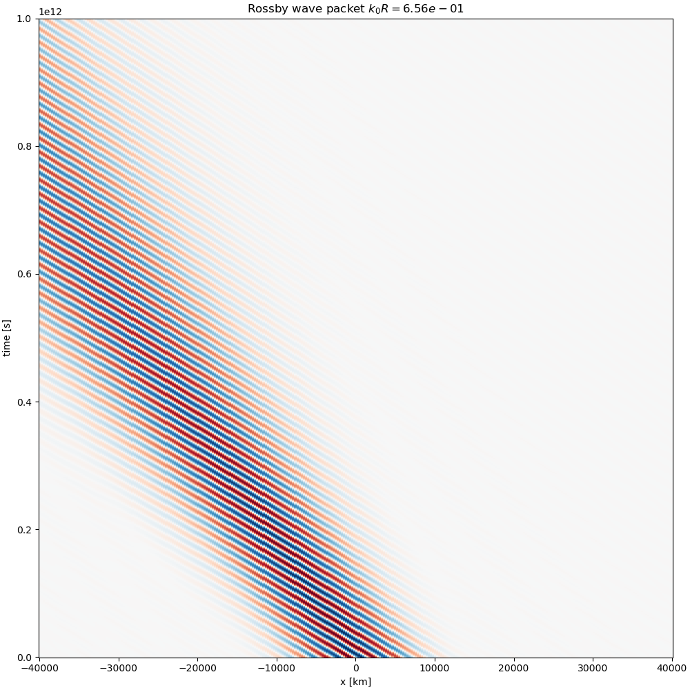

# Wave phenomena:

- shallow water waves
- Poincarre waves
- Kelvin waves
- Rossby waves

We love to determine steady state solutions in physics.  However, forcing is rarely steady in natural systems, so it is helpful to consider the response to time varying forcing.  These responses often have an oscillatory component that can propagate long distances from the source of forcing as waves.  These waves carry energy, and the signal of the changes to the system.

Note that for much of this discussion we will assume an oscillatory response - i.e. that the response is sinusoidal in time, and usually at least one direction in space.  This is a gross simplification, but we can combine different waves to get more complicated responses in a superposition.

## Wave properties and shallow-water waves

In the ocean, waves typically manifest them selves as sea level height changes ($\eta$) and velocity anomalies ($u$).  In space, the wave may have a wavelength $\lambda$, which is the distance between two successive crests and be described by a sinusoid:
$$\eta(x,t=t_0) = \eta_0 \sin\left(\frac{2\pi}{\lambda} x + \phi_0\right)$$
where $\eta_0$ is the amplitude of the wave, and $\phi_0$ a phase offset.  If the wave is propagating in time, there will be a time dependence as well which will have a certain periodicity $T$, so
$$\eta(x,t) = \eta_0 \sin\left(\frac{2\pi}{\lambda} x - \frac{2\pi}{T}t+\phi\right).$$
where $\phi$ is now a constant that depends on the initial conditions of the wave.  The wave number $k$ is defined as $k = \frac{2\pi}{\lambda}$, and the frequency $\omega = \frac{2\pi}{T}$.  The _phase speed_ of the wave is then
$$c = \frac{\omega}{k} =  \frac{\lambda}{T}.$$

Often it is useful to look at the propagation of a wave in a _Hovmoller diagram_, where the x-dependence is plotted on the horizontal axis and the time dependence on the vertical axis.  Mathematically this wave is given by
$$\eta(x,t) = \eta_0 \sin\left(k x - \omega t + \phi\right),$$
where $\eta_0=0.1\ \mathrm{m}$, $k = 2\pi/ 450\ \mathrm{rad\,m^{-1}}$,  $\omega = 2\pi/ 30\ \mathrm{rad\, s^{-1}}$ and $\phi = 0.72\ \mathrm{rad}$.  Because both $k$ and $\omega$ are positive, the wave is propagating in the positive $x$ direction, and wave crests and troughs move upwards and to the right in the Hovmoller diagram.  The slope of those lines in the "phase speed".

### Group speed

Waves carry energy, but the speed at which that energy propagates is not always the same as the phase speed of the wave.  The speed at which the energy propagates is called the _group speed_ $c_g$.  For a wave with a sinusoidal form, the group speed is given by
$$c_g = \frac{d\omega}{dk}.$$
For shallow water waves, we noted that $\omega = k\sqrt{gH}$ where $H$ is the water depth, so both the phase speed and the group speed are given by
$$c = c_g = \sqrt{gH}.$$
Waves like this was called _non-dispersive_ waves because waves that start traveling together will remain traveling together.

The energy in waves is carried by the superposition of waves to form a _packet_.  The simplest packet is given by the superposition of two waves with slightly different wavenumers $k+\delta k$ and $k-\delta k$ and correspondingly different frequencies $\omega + \delta \omega$ and $\omega - \delta \omega$.  The resulting wave packet is given by
$$\eta(x,t) = \eta_0 \overbrace{\sin\left(k x - \omega t + \phi\right)}^{\mathrm{phase}} \overbrace{\cos\left(\delta k\, x - \delta \omega\, t\right)}^{\mathrm{packet}}.$$
which is a wave with $k$ and $\omega$ modulated by a wave with $\delta k$ and $\delta \omega$.  The phase speed is again $\omega/k$, and the packet, or group speed in given by $c_g = \delta \omega / \delta k = \mathrm{d}\omega/\mathrm{d}k$.  The group speed is the speed at which the envelope of the wave packet propagates, and is the speed at which energy is transported by the wave.

The picture below is a very tight wavepacket made of a 64 waves with different values of $k$ and $\omega$.  Note how the waves start in phase and remain in phase, and that the phase of the waves moves with the packet:

Of course where this gets interesting is when waves are _dispersive_, which means different wavenumbers travel at different speeds.  Not shown in this class, but an example are deep-water surface waves where
$$\omega = k\sqrt{g/k} = \sqrt{gk}$$
and the phase speed if $c = \sqrt{g/k}$.  Note that longer waves (smaller $k$) travel faster than shorter waves (larger $k$).  This means that waves that are initially travelling together will move out of phase, and wave packets will spread and move at a different speed than the phase speed.
For shallow water waves, the group speed is then given by
$$c_g = \frac{d\omega}{dk} = \frac{1}{2} \sqrt{\frac{g}{k}} = \frac{1}{2}c.$$
This means that the group speed is half the phase speed.

We can see this effect in the same wavepacket as above, but under deep-water physics. First the angle made by the phase speed is more shallow that that made by the packet.  Waves emerge from the tailing edge of the packet, propagate faster than the packet, and then disappear at the leading edge.  For this case the group speed is half the phase speed.  The packet also spreads out with the longer waves in the packet moving faster and emerging out the front of the packet, while the shorter waves lag behind. This is what is meant by _dispersion_.

## Poincarre waves: "shallow" surface gravity waves affected by the Coriolis force

We can consider the effect of the Coriolis force on the shallow water equations and derive a slightly modified version of the shallow water waves from that discussed earlier.  If the pressure gradient is just given by the sea-surface tilt, and we ignore nonlinear effects then the equations of motion are
$$\frac{\partial u}{\partial t} - f v = -g \frac{\partial \eta}{\partial x},$$
$$\frac{\partial v}{\partial t} + f u = -g \frac{\partial \eta}{\partial y},$$
$$\frac{\partial \eta}{\partial t} + H \left(\frac{\    \partial u}{\partial x} + \frac{\partial v}{\partial y}\right) = 0.$$
If we assume solutions of the form:
$$u = u_0 e^{i(k x + l y - \omega t)},$$
$$v = v_0 e^{i(k x + l y - \omega t)},$$
$$\eta = \eta_0 e^{i(k x + l y - \omega t)},$$
where $k$ and $l$ are the zonal and meridional wavenumbers, respectively, we can substitute these into the equations of motion and solve for the dispersion relation
$$\omega\left[\omega^2-f^2-gH\left(k^2+l^2\right) \right] = 0$$
$\omega=0$ is the steady solutuion, so the oscillatory solution is given has a dispersion relation given by:
$$\omega^2 = gH\left(k^2 + l^2\right) + f^2,$$
Note that as $\omega \gg f$, this is the same as the shallow water dispersion relation.  Note also that $|\omega| > f$ for the wave to propagate.

Note that here we have been more general and allowed for both zonal and meridional wavenumbers, $k$ and $l$.  This means that the wave can propagate in any direction, and the phase speed is given by
$$c = \sqrt{\frac{gH\left(k^2 + l^2\right) + f^2}{k^2 + l^2}}$$
in a direction given by the angle
$$\tan\theta = \frac{l}{k}.$$

The group speed for the Poincarre wave is not quite the same as the phase speed in the x-or y directions:
$$ c_{g_x} = \frac{d\omega}{dk} = \frac{gH k}{\sqrt{gH\left(k^2 + l^2\right) + f^2}}.$$
$$ c_{g_y} = \frac{d\omega}{dl} = \frac{gH l}{\sqrt{gH\left(k^2 + l^2\right) + f^2}}.$$
Note that this points in the same direction as the phase speed.  To see this, assume $l=0$, then $c_x = \sqrt{gH + f^2/k^2}$, and $c_y = 0$, and
$$c_{g_x} = \frac{gHk}{\sqrt{gH k^2 + f^2}}$$
The ratio of these is
$$c_x/c_{g_x} = \frac{\sqrt{gH + f^2/k^2}}{gHk/\sqrt{gH k^2 + f^2}} = 1 + \frac{f^2}{gHk^2}$$
So the phase speed is larger than the group speed.  Note that for $\sqrt{gH}k \gg f$, the two speeds become very similar.

For free waves, there is a strong limitation that the frequency of the wave must be larger than the Coriolis frequency $\omega > |f|$, and $f$ changes with latitude.  This means that a wave that starts at a given latitude $\omega_0 > f_0$ can propagate poleward, but may reach a latitude where $\omega_0 \approx f_f$.  At this point the wave cannot propagate further poleward, and will be refracted back equatorward.

Note that Poincarre waves have a component of velocity that can be perpendicular to the direction of phase propagation.  So if the wave is propagating eastward, the obsevered velocities will have a component that is north-south.  You can demonstrate this by considering the system of equations above: eliminating $\eta$ from the first two equations  gives:
$$\frac{\partial^2 u}{\partial t\partial y} - f^2 \frac{\partial v}{\partial y} = \frac{\partial^2v}{\partial x \partial t} +f \frac{\partial u}{\partial x} $$
or
$$u_0\left(l\omega - i k f \right) = v_0\left(k\omega + i l f \right).$$
If we assume $l=0$, then we have
$$v_0 = \frac{-i f}{\omega} u_0,$$
which means that the meridional velocity is out of phase with the zonal, and will be smaller by the factor $f/\omega <1$. Note that as $\omega \approx f$ the velocities become very similar in magnitude, whereas if $\omega \gg f$, the meridional velocities are much smaller than the zonal velocity.

## Kelvin waves

Signals can also travel along coastal boundaries as _Kelvin waves_, and unlike free Poincarre waves can have frequency that is less than the Coriolis frequency ($f$). If a wave is forced along the boundary, say in the y-direction, then the wave will propagate along the boundary with the boundary on the right (in the northern hemisphere).  We can derive the dispersion relation for these waves by considering the x and y components of the equations of motion, and assuming that if we are along the boundary $v \ll u$, so the equations of motion simplify to:

$$- f v = -g \frac{\partial \eta}{\partial x},$$
and
$$\frac{\partial v}{\partial t} = -g \frac{\partial \eta}{\partial y},$$
and
$$\frac{\partial \eta}{\partial t} +  H \frac{\partial v}{\partial y}= 0.$$

We can form a wave equation for the propagation in the y-direction by eliminating $v$ from the first two equations:
$$\frac{\partial^2 \eta}{\partial t^2} = -gH \frac{\partial^2 \eta}{\partial y^2} $$
which is just the shallow-water wave equation with solution:
$$\eta(x, y,t,) = \eta_0(x)\, e^{i\left(ly - \omega t\right)}.$$
and dispersion relation is just the shallow water dispersion relation:
$\omega = \sqrt{gH} l$.  We can also see that the velocity is given by
$$v_0(x) = - H \frac{l}{\omega}\eta_0(x) = \sqrt{\frac{g}{H}}\eta_0(x)$$

The amplitude of the wave $\eta_0(x)$ has an x-dependence that decays exponentially away from the boundary.  We can see this from the first equation which can be written as
$$\eta(x) = \frac{\sqrt{gH}}{f} \frac{\partial \eta}{\partial x}$$
which has a solution
$$\eta_0(x) = A e^{\frac{f}{\sqrt{gH}}x}.$$
This means that the amplitude of the wave decays exponentially away from the boundary with a horizontal scale of $L_R = \sqrt{gH}/f$.  $L_R$ is called the Rossby radius of deformation and is the distance a shallow water wave can propagate in a Coriolis period.

We can get a nice idea of how the wave propagates by considering a series of high and low sea level along the boundary. To leading order, the velocity is in geostrophic balance, so the flow is clockwise around the highs, and anti-clockwise around the lows.  This leads to a convergence poleward of the highs, and divergence poleward of the lows, and hence the highs and lows propagate poleward.

If $l$ is negative, then the wave requires a wall on the left, and propagates equatorward: eg with the boundary on the right relative to the direction of propagation.  The same applies in any direction along a coast.

As an example, the coast of British Columbia is heavily affected by sea level changes due to winds in Oregon and Washington to the south.  These sea levels change, and the sea level changed propagate northward as ``coastally trapped waves'' which are at leading order simply Kelvin waves.  Kelvin waves also are important in the tropics where they are called _equatorial Kelvin waves_.  These waves propagate eastward along the equator, and are important in the El Nino-Southern Oscillation (ENSO) phenomenon.

## Rossby waves

On a much larger scale, there are waves that can propagate due to variations in the Coriolis force with latitude called _Rossby waves_.  These are very important in propagating basin-scale signals in the ocean, and the propagation of weather systems in the atmosphere.

In order to derive the dispersion relation for Rossby waves, we start with the shallow water equations, but allow for $f = f_0 + \beta y$, where $\beta$ is the variation of the Coriolis parameter with latitude.  The equations of motion are then
$$\frac{\partial u}{\partial t} - \left(f_0 + \beta y\right) v = -g \frac{\partial \eta}{\partial x},$$
$$\frac{\partial v}{\partial t} + \left(f_0 + \beta y\right) u = -g \frac{\partial \eta}{\partial y},$$
$$\frac{\partial \eta}{\partial t} + H \left(\frac{\    \partial u}{\partial x} + \frac{\partial v}{\partial y}\right) = 0.$$

For large scale flows low Rossby-number flows, eg $|\mathbf{U}|/Lf \ll 1$, the flow is almost in geostrophic balance, so we can write $u = -\frac{1}{f}\frac{\partial \eta}{\partial y} + u'$ and $v = \frac{1}{f}\frac{\partial \eta}{\partial x}+v'$, where $u'$ and $v'$ are the _ageostrophic_ components of the flow.  This allows us to write the shallow water equations in what is called the _quasi-geostrophic approximation_.  In this approximation, we assume that the ageostrophic components of the flow are small compared to the geostrophic components, and that the flow is nearly in geostrophic balance.  This means that we can neglect terms that are non-linear in the ageostrophic components.

We can substitute these into the equations above, and neglect terms that are non-linear in the ageostrophic components.  So for instance, the x-momentum equation becomes
$$-\frac{1}{f}\frac{\partial^2 \eta}{\partial y \partial t}
+\frac{\partial u'}{\partial t} - f_0\frac{\partial \eta}{\partial x} -f_0 v' - \beta y \frac{1}{f}\frac{\partial \eta}{\partial x} - \beta y v' = -g \frac{\partial \eta}{\partial x}.$$
If $v'\ll v_g$ and $u' \ll u_g$, then we can neglect the ageostrophic terms, and the equation becomes
$$-\frac{1}{f}\frac{\partial^2 \eta}{\partial y \partial t}
 -f_0 v' - \beta y \frac{1}{f}\frac{\partial \eta}{\partial x} = 0.$$
 Similarly
$$+\frac{1}{f}\frac{\partial^2 \eta}{\partial x \partial t}
 +f_0 u' - \beta y \frac{1}{f}\frac{\partial \eta}{\partial y} = 0.$$
The continuity equation becomes:
$$\frac{\partial \eta}{\partial t} + H \left(\frac{\    \partial u'}{\partial x} + \frac{\partial v'}{\partial y}\right) = 0$$
because the geostrophic components cannot have a divergence:
$$\frac{\partial u_g}{\partial x} + \frac{\partial v_g}{\partial y} = -\frac{g}{f}\frac{\partial^2 \eta}{\partial x \partial y} + \frac{g}{f}\frac{\partial^2 \eta}{\partial y\partial x}=0$$

Combining the above, we can write a single equation for the surface height $\eta$:
$$\frac{\partial \eta}{\partial t} - R^2\frac{\partial}{\partial t} \nabla^2 \eta - \beta R^2\frac{\partial \eta}{\partial x} = 0$$
where $R^2 = gH/f_0^2$ is the square of the Rossby radius of deformation.

Assuming solutions of the form $$\eta(x,y,t) = \eta_0 e^{i(k x + l y - \omega t)},$$
we can substitute this into the equation above to get the dispersion relation:
$$\omega(k, l) = -\beta R^2 \frac{k}{1+R^2\left(k^2+l^2\right)}.$$

First we note that the phase speed in the east-west direction (x-direction) is given by $\omega/k$:
$$c_x = \frac{\omega}{k} = -\beta R^2 \frac{1}{1+R^2\left(k^2+l^2\right)},$$
so the phase always propagates towards the west.  This propagation to the west is seen clearly in Hovmoller plots of data in both the ocean and atmosphere.

Note that we can argue that these are indeed low-frequency waves by considering the case of short or long waves.  For short waves, $k^2 + l^2 > 1/R^2$, so
$$\omega \approx -\beta k/\left(k^2+l^2\right) \sim \beta L \ll f$$
Conversely for long waves $k^2 + l^2 < 1/R^2$, so
$$\omega \approx -\beta R^2 k \sim \beta R^2 / L < \beta L \ll f$$
so the waves are indeed low-frequency waves.

We can rewrite the dispersion relation to get a geometric representation of the dispersion relation:
$$\left( k +\frac{\beta}{2\omega} \right)^2 + l^2 = \left(\frac{\beta^2}{4\omega^2} -\frac{1}{R^2}\right)$$
These are circles centered at $-\beta/2\omega$ in the k-direction, and with radius $\sqrt{\beta^2/4\omega^2 - 1/R^2}$, so the circles do not quite touch the origin:

Each frequency gets its own circle in this representation (so there are three frequencies represented above).  The phase speed is directed outwards from the circle along a line that joins the wavenumber to the origin of the $k-l$ plane, and because all points on the circle are to the left of the origin, all phase speeds have a component directed to the west.

The group speed is given by
$$\mathbf{c_g} = \frac{d\omega}{dk}\mathbf{\hat{i}} + \frac{d\omega}{dl}\mathbf{\hat{j}},$$
and therefore are directed perpendicular to the circle in the $k-l$ plane. A bit of math shows that it is always pointed inward from the circle.  This means that energy propagates eastward for shorter waves with $k>\frac{\beta}{2\omega}$, and westward for longer waves with $k<\frac{\beta}{2\omega}$.

The following is a comparison of a Hovmoller diagram for a short Rossby wave packet made up of 16 waves with $l=$.  Phase propagation is always to the left, but the _packet_ propagates to the right

If the packet is instead made up of longer waves, the phase is still to the left (and propagates faster), and the packet propagates to the left, and at a slower speed.

### Topographic Rossby waves: Potential vorticity derivation

The same equations can be derived from the conservation of potential vorticity. This is useful because we can then see how Rossby waves can form due to sloping topography, and below it gives some idea of what the restoring force is for the waves.

Recall that potential vorticity is given by
$$q = \frac{f(y) + \zeta}{H(x,y)+\eta}$$
where $\zeta$ is the relative vorticity, and $H(x,y)$ is the depth of the fluid which we will now allow to vary.  For linear waves $\eta \ll H$, so we can use a Taylor expansion of the denominator:
$$q \approx \frac{f + \zeta}{H}\left(1 - \frac{\eta}{H}\right),$$
or
$$q \approx \frac{1}{H}\left(f + \zeta - f\frac{\eta}{H}\right),$$
Note that this is the planetary PV $\overline{q} \equiv f/H$ plus a perturbation due to the wave, $q'$. The conservation of potential vorticity says that
$$\frac{\partial q}{\partial t} + \mathbf{u}\cdot\nabla q = 0.$$

Lets assume that $H = H_0 + \alpha x$ so that the depth varies linearly in the x-direction, so now the wave is on a slope.  If $\alpha<0$ then the water is more shallow to the right.  Lets also assume that $f=f_0$ and ignore the beta effect for now.

If we have linearize the PV equation we get
$$\frac{\partial q'}{\partial t} + \mathbf{u}\cdot\nabla \overline{q} \approx 0$$
where we have dropped the advection of perturbation PV in favour of the generally much larger planetary PV.  Given $\overline{q} = f_0/H$, we can write the advection term as
$$\frac{\partial q'}{\partial t} + - u\frac{f\alpha}{H^2} \approx 0,$$
or
$$\frac{\partial}{\partial t}\left(\frac{\zeta}{H} - \frac{f\eta}{H^2}\right) + - u\frac{f\alpha}{H^2} = 0,$$

As above, we can assume that to first order the flow is geostrophic, so $u = -\frac{1}{f}\frac{\partial \eta}{\partial y}$ and $v = \frac{1}{f}\frac{\partial \eta}{\partial x}$, so we can write the equation as
$$\frac{\partial}{\partial t} \left(\nabla^2 \eta - \frac{\eta}{R^2}\right) = +\frac{f\alpha}{H}\frac{\partial \eta}{\partial y} = 0$$
and we can see that $f\alpha/H$ is exactly the same term as $\beta$ in the previous derivation.  Of course if the topography sloped in the other dimension we'd have a similar term with $\partial \eta/ \partial x$ instead.

In this situation the math is exactly the same, except the phase velocities are now directed with the shallow topography on the right (for $f>0$).  Hence coastally trapped waves can propagate with the coast to their right following a Kelvin-wave solution, and on their left following a Rossby wave solution.

The restoring force for Rossby waves is the conservation of angular momentum/potential vorticity.  Take the slope case - if a water parcel moves into deeper water, planetary vorticity will be stretched, and a cyclonic water velocity will be created.  Conservation of potential vorticity means that this water will want to move back towards shallower depth, but as with any oscillation, it overshoots its resting depth, and moves to shallow water where it develops an anticyclonic circulation.  The same happens on a flat bottom but with the water parcel moving north or south to anomalously high or low planetary vorticity.

The phase propagation results from water parcels displaced in a sine wave.  Consider on the beta plane, water displaced to the north will develop an anticyclone, and water displaced to the south will develop a cyclone.  To the left of the anticyclone, both eddies will tend to push water at the central latitude north.  Similarly, to the right of the cyclone, both eddies will tend to push water south, and hence the disturbance propagates to the left, or west.

## Summary

Waves are how energy propagates in the ocean and atmosphere.  If you force a disturbance at a certain frequency, it will have a response that oscillates in time, and often in space, and it may propagate away as a wave.  Depending on the dominant physics of the situation, the characteristics of that propagation can change.  In general, if there is a coastline, Kelvin waves can exist at any frequency, though they may be modified by topographic beta effects $\alpha$ if there is a slope to the bathymetry.  Waves away from the coast can either be Poincarre waves with relatively high frequencies $\omega>f$, and an assymptote to waves where the Coriolis force doesn't matter, as in the case of ocean swell $\omega \gg f$.  Much slower changes propagate on large scales as Rossby waves.

The following figure shows Hovmoller diagrams at different latitudes in the Pacific Ocean.  Note that $\beta$ gets smaller the further north, so the phase speed tends to decrease.

