# Overturning Circulation

So far we have dealt largely with lateral circulations driven by the wind.  The global thermohaline overturning circulation is mostly driven by density differences, largely due to heat gain towards the equator and heat losses towards the poles.  However, if these density differences were just at the surface, we would not expect a large overturning circulation.   Instead vertical mixing mixes heat down and creates lateral pressure gradients at depth that drive a much more vigorous circulation.

- surface heat budget
- review of density and pressure gradients.
- role of vertical mixing in driving overturning
- Stommel Aarons theory

## Surface heat budget

The net heat budget through the surface of the ocean is actually hard to estimate accurately.  There are heat gains from solar radiation, losses from longwave radiation, losses from evaporation to the atmosphere, and direct exchange of heat with the atmosphere.  The net budget is such that the ocean gains heat in the tropics and loses heat at high latitudes.  This is shown in the figure below, which shows the net heat flux into the ocean.

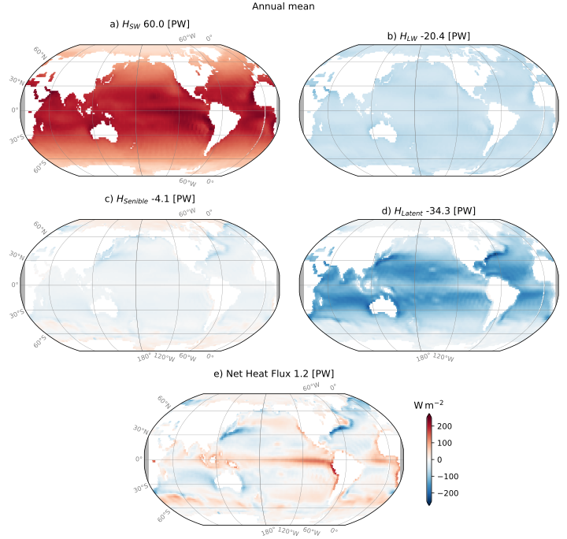

From these estimates, we can see that the incoming radiation is the largest positive heat gain to the ocean ($H_{SW}$) inputting heat at a rate of 60 PW ($10^15 \mathrm{J/s}$).  This incoming heat is largest at the equator and decreases towards the poles.  Note that the spatial variation in this heat flux is largely due to cloud cover.  This is, of course, a major source of uncertainty in these estimates - incoming solar radiation from space can be derived geometrically, but the amount that reaches the ocean surface depends on the cloud cover.

The ocean reflects energy back into the atmosphere due to blackbody radiation $H_{LW} \approx -20 \mathrm{PW}$.  However, much of this energy is trapped by the atmosphere, so the net loss is far less than can be calculated from the ocean surface temperature alone.  In addition for needing to account for cloud cover, we need to know the surface temperature of the ocean, which can be done quite well from satellites, if there is no cloud cover.

The ocean also exchanges heat with the atmosphere due to just being in contact with each other and having a temperature gradient across the interface. This is called sensible heat flux, and tends to be a net loss of heat from the ocean $H_{SH} \approx -4 \mathrm{PW}$.  Note that the largest sensible heat fluxes are in the western boundary currents of the suptropical gyres where warm water is brought poleward and then exposed to westerly winds that blow off the land masses (particularly in the north Pacific and Atlantic).

Finally, the most substantial heatloss comes from evaporation, or latent heat flux $H_{latent} \approx -34 \mathrm{PW}$.  Evaporative heat losses are largest in the equatorial regions and again in the western boundary currents where the air off the continents is dry.

The net heat flux should be close to zero, but in the data set shown above there is a 1.2 PW imbalance.  Some of this is due to global warming, but our best estimates of this are around 0.25 PW.  The remainder is due to uncertainties in the estimates.

Of course the heat fluxes above vary seasonally:  compare the plots below for the Boreal summer and winter:

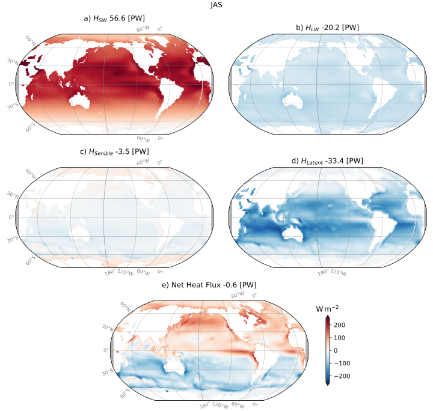
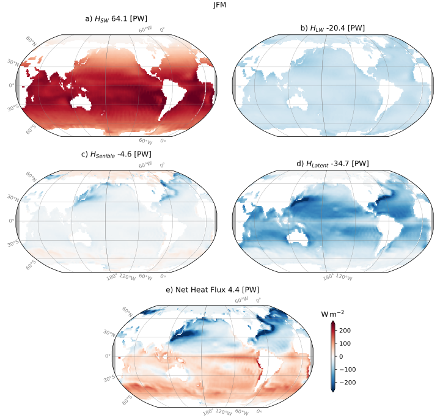

The net heat flux can be integrated over the surface of the ocean to get a total heat flux per degree of latitude (or alternatively you could do as per distance in the poleward direction).  The net input of heat is actually in quite a narrow band around the equator, and largely consists of net losses poleward of 15 degrees latitude.  Again this estimate has a large residual indicating uncertainty with the estimates.

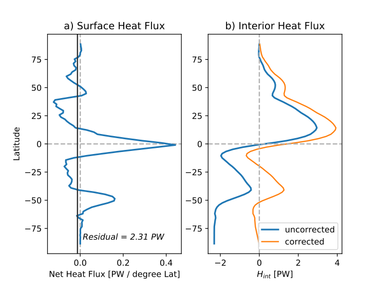

We can infer something about the net circulation of the ocean from this heat flux profile alone.  If we assume the ocean is not warming too rapidly in any one spot, then the ocean must transport heat from the equator towards the poles.  The interior transport of heat $\mathcal{T}_{int}$ can be readily calculated from the incoming heat per degree of latitude $H_{incoming}$ by considering the net heatflux:
$$\frac{\mathrm{d} Q^* }{\mathrm{d} t} = H_{incoming} - \frac{\mathrm{d}\mathcal{T}_{int}}{\mathrm{d}\lambda}$$
So in steady state, the divergence of the transport is balanced by the net flux of heat in or out of the ocean, and  $\mathcal{T}_{int} \approx \int_0^{\lambda} H_{incoming} \, d\lambda$ is the total interior transport of heat up to latitude $\lambda$.  This is plotted above as the blue line.  Note that the estimated transport does not go to zero at the southern ocean, again reflecting the net error in the estimates.  However, the general shape of the curve is that the interior transport is away from the poles at most latitudes.

Note that these transports are integrated in the east-west direction, so they are net of any lateral circulation.  They imply that warm water is moving poleward, and unless we want water to pile up at the poles, there must be a return flow of cold water towards the equator.  It is actually useful to put some numbers on this transport.  If the temperature difference between the equator and the poles is about 25 degrees, and the heat capacity of seawater is about $4 \times 10^3 \mathrm{J/(kg \cdot K)}$,  the 2 PW of heat transport implies can be expressed as a volume transport of about 20 Sv.  Of course the real situation is much more complicated than this, but it gives a sense of the scale of the overturning circulation.

Note that there is also a salt-driven component to this circulation. Because of the large freshwater flux at the equator, the transport inferred by the fresh water fluxes is similar in direction to that inferred from the heat fluxes.  Note also that the largest evaporation is where the largest latent heat losses are, though much of the fresh water precipitates back into the ocean downwind of where it evaporates.

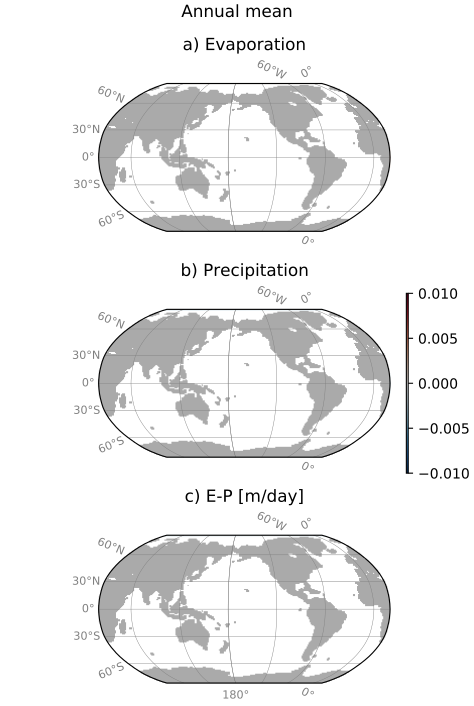

## What drives the overturning circulation?

The overturning circulation is driven by density differences at given depths in the ocean. The water at the equator tends to be warmer than the water towards the poles, and hence is lighter.  This creates lateral pressure gradients so that the dense water moves under the lighter water.  Predicting these pressure gradients  a-priori  is actually quite difficult, and one of the reasons overturning circulations are often omitted from textbooks that prefer analytical solutions.

Qualitatively, we can look at the next plot to get an idea of what is happening.  This is a section of data from along 165 W of potential temperature (the temperature water would be if brought to the surface adiabatically) and salinity.  The Pacific ocean is a helpful example because the North Pacific doesn't get cold enough to participate in the overturning circulation (unlike the North Atlantic), and therefore there is only cold water sinking in the Southern Ocean.  Hopefully it is clear that dense water is quite cold and salty and sinking in the Southern Ocean and spreading along the seafloor towards the north.

The Indian Ocean is not wildly dissimilar to the Pacific, except it does not reach as far North.  Cold water sinks in the Southern Ocean and spreads northwards along the sea floor. The Atlantic is is a little different.  The Southern Ocean still creates dense water that spreads along the seafloor in the Atlantic.  This water is everywhere called _Antarctic Bottom Water_ (AABW).  However, the North Atlantic is also a source of dense water, and this water is called _North Atlantic Deep Water_ (NADW).  This water is formed in the Labrador Sea and the Greenland Sea, and spreads southwards at a depth of approximately 3000 m.  This is a little hard to see in the plots above, but is a very robust feature of the overturning circulation.

As an aside, some features of the wind-driven circulation can be seen in the plots above.  The warm ``bowls'' of water centered at +/-30 degrees are the subtropical gyres where water is being pushed down by Ekman pumping.  We also see evidence of cold fresh water being drawn down to 1000 m depth and then moving equatorward under the subtropical gyres, consistent with the idea that the Sverdrup transport there is towards the equator; these are called Antarctic Intermediate water and North Pacific Intermediate water. This story is a little complicated in the Atlantic, where there is a pulse fo salty water at those depths, largely due to dense water pouring from the Mediterranean Sea.  This waster is termed _Mediterranean Outflow Water_ (MOW) and is a large reason the Atlantic is saltier than the Pacific.  Similar water is found in the Indian Ocean as well where there are outflows from the Red Sea and the Persian Gulf.

Returning to the deep water, the temperature difference lead to density differences and hence pressure gradients. In this case, the baroclinic pressure under 50 S is larger than that below 20 S because there is more cold water there.  This will tend to push the water from 50S towards 20 S.  This is usually true in general - isopycnals want to be flat, and there is usually a pressure gradient that will affect that change.  (Of course the pressure gradient could be balanced by a geostrophically balanced flow perpendicular to the pressure gradient, but even that usually "loses balance" and the isopycnals will tend to flatten due to instabilities).

These density differences can also be thought of in terms of _Available Potential Energy_.  This is the potential energy in the water that is available to become kinetic energy, and is relative to the _Background Potential Energy_ state of the water.  This concept is easiest understood from a two layer system. Imagine we have a box that is $L$ wide, $2H$ deep,  and  $W$ in the cross-plane direction.  The upper layer has density $\rho_1$ which is less that the density of the lower layer $\rho_2$.  Suppose that all of the dense water is in the left side of the box, and all the light water on the right side.  Obviously this is unstable, and if we let the water flow, the dense water will flow under the light (this is called the "lock exchange problem").

We can compute a potential energy for this system by integrating in x and z:
$$PE = \int_0^{2L} \int_0^{2H} \rho g z \, \mathrm{d}z \, \mathrm{d}x$$
where $g$ is the acceleration due to gravity.  For the initial state described above it is easy to see that the potential energy is:
$$PE_{0} = 2H^2 g WL \left(\rho_1 + \rho_2 \right) + A$$
where $A$ is an arbitrary constant.  This is not the "Available" energy because the background state has some energy.
$$PE_{background} = gLW H^2\left(\rho_2  + 3\rho_1\right) + A$$
The difference between these two is the Available Potential Energy (APE):
$$APE = PE_{0} - PE_{background} = gWL H^2 \left(\rho_2 - \rho_1\right)$$
This gives an idea how much energy is available to drive the flow.  Of course this energy eventually gets lost to friction during a lock exchange event.

## Inferring the strength of the overturning circulation

This is quite difficult because the ocean is large and the overturning circulation is relatively weak compared to things like eddies and tides.  Nevertheless, velocity estimates are possible across the ocean gyres, and then box models can be constructed to estimate the strength of the overturning.  There was a global effort in the 1990s to make these lines called the World Ocean Circulation Experiment (WOCE) and one of its goals was to estimate the strength of the overturning circulation.  So for example we can estimate the velocities and densities along P3 to estimate the over turning circulation in the Pacific Ocean.

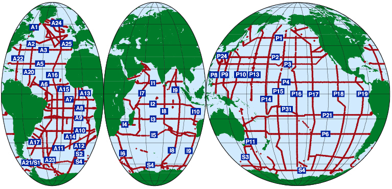

In order to see how this works, recall the advection-diffusion equation:

$$\frac{\partial \rho}{\partial t} +  \nabla \cdot \left( \mathbf{u}\rho\right) = \nabla \cdot (K \nabla \rho)$$
or because we are looking at a volume:
$$\int_V \frac{\partial \rho}{\partial t} \, dV + \int_V \nabla \cdot \left( \mathbf{u}\rho\right) \, dV = \int_V \nabla \cdot (K \nabla \rho) \, dV$$
and using the divergence theorem, we can write this as:
$$\frac{\partial}{\partial t} \int_V \rho \, dV + \int_S \rho \mathbf{u} \cdot \mathrm{d}\mathbf{S} =  \int_S \left(K\nabla\rho\right) \cdot \mathrm{d}\mathbf{S}$$
where $\mathbf{S}$ is the surface of the volume $V$ and the vector points _outwards_ perpendicular to the surface.

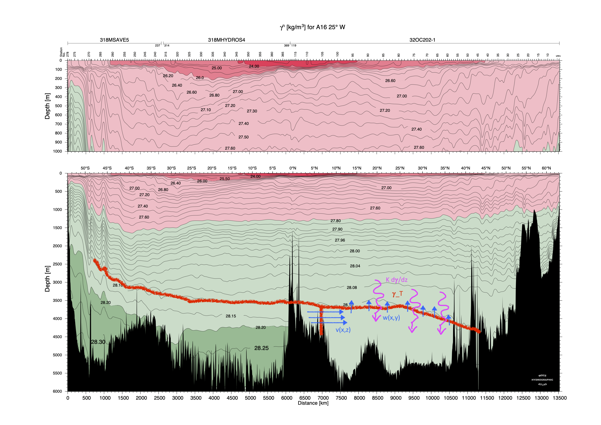

For the picture above, dense water is pouring into the Pacific.  Two things can happen, either the Pacific fills up with more dense water, or the dense water mixes with lighter water as it flows north.  In terms of the equation above, we can define a volume at a latitude, and consider the top of the volume bounded by an isopycnal surface $\rho_{top}$.  IF we assume the first term is small, then the second term can be written as the difference between the inflow at our latitude, and the _diapycnal_ outflow across the isopycnal surface:
$$-\int_0^W \int_{-H}^{z_{\rho_T}} v(x, z) \rho(x,z)\,\mathrm{d}x\,\mathrm{d}z + \int_0^W\int_{\lambda_0}^{\lambda_1}\rho_T\, w_T(x,y) \, \mathrm{d}x\,\mathrm{d}y = \int_0^W\int_{\lambda_0}^{\lambda_1}\left[K \frac{\partial \rho}{\partial z}\right]_T \, \mathrm{d}x\,\mathrm{d}y$$
where we have made the _approximation$ that $\frac{\partial \rho}{\partial x}\ll\frac{\partial \rho}{\partial z}$ in the diffusive term.
We can also note from continuity that if water is flowing in from the south, and we are in steady state, then water must flow out the top of the isopycnal surface at the same rate, $q$:
$$q\equiv\int_0^W \int_{-H}^{z_{\rho_T}} v(x, z)\,\mathrm{d}x\,\mathrm{d}z = \int_0^W\int_{\lambda_0}^{\lambda_1} w_T(x, y) \, \mathrm{d}x\,\mathrm{d}y$$
We could rewrite as
$$q(\rho_S - \rho_T) = - \int_0^W\int_{\lambda_0}^{\lambda_1}\left[K \frac{\partial \rho}{\partial z}\right]_T \, \mathrm{d}x\,\mathrm{d}y$$
where $\rho_S$ is the velocity-weighted average density of the water coming in from the south.  We can similarly come up with an average value for $K$ based on the K-weighted average density gradient across the isopycnal surface:
$$q(\rho_S - \rho_T) = - A \overline{K}\left[\overline{\frac{\partial \rho}{\partial z}}\right]_T$$
where $A$ is the area of the surface of the isopycnal, and $\overline{K}$ is the average value of $K$ across the isopycnal surface.  This gives us a way to estimate the overturning circulation from the density gradient across an isopycnal surface.  Note that both sides are greater than zero ($\rho_S>\rho_T$) and $\overline{\frac{\partial \rho}{\partial z}}<0$), and the mixing co-efficient is typically positive.

We can do a rough calculation for $\overline{K}$ using estimates for the strength of the overturning circulation in the Pacific of $q\approx 5 \mathrm{Sv}$, a density difference of $\rho_S - \rho_T \approx 0.1 \mathrm{kg/m^3}$, and an area of the isopycnal surface of $A\approx 5\times10^7 \mathrm{km^2}$, and $\partial\rho/\partial z \approx 7\times10^{-5}\ \mathrm{kg\, m^{-4}}$ This gives us a rough estimate of the mixing coefficient
$$\overline{K} \approx \frac{q(\rho_S - \rho_T)}{A\left[\overline{\frac{\partial \rho}{\partial z}}\right]_T} \approx 1.5\times 10^{-4}\ \mathrm{m^2/s}$$

The procedure sketched out above yielded the estimates of the overturning circulation shown below.  The deep overturning circulation in each basin is shown by the green arrows for water denser than $\gamma^n =  28.11$, where $\gamma^n$ is the neutral density (very similar to "potential density").  Approximately 7 Sv makes it north of 15 S in the Pacific, and 1.5 Sv north of 25 N, meaning that 5.5 Sv is inferred to be upwelling between 15 S and 25 N.  This upwelling must be balanced by a downward mixing buoyancy flux in order for the dense water to not accumulate.

This procedure has been carried out in the WOCE experiment across the major ocean basins (see below).  We can see that the overturning is particularly weak in the Pacific, and strongest in the Indian and Atlantic Oceans.

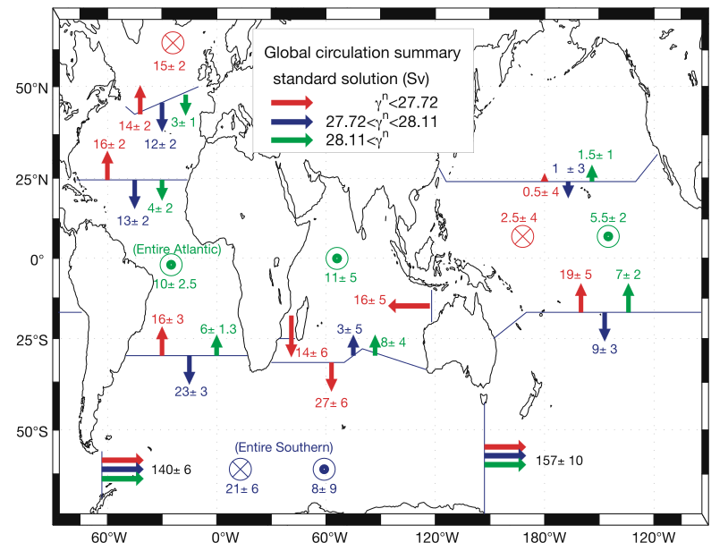

## Importance of vertical mixing to driving overturning: Sandstrom's theorem

In the above, we saw that for the overturning circulation to be in steady state, the flow of dense water must be counterbalanced by vertical mixing making the water less dense.  We also saw above that there are buoyancy differences in the surface forcing.  Mixing plus these buoyancy differences determine the strength of the overturning circulation.

There are a few ways to see this, but perhaps the most useful is to go back to our two-layer system.  Imagine the two equal layers are initially at rest and flat, and then half the water is mixed from top to bottom to form a third layer in the right side of the tank.  This new layer will have a density that is half way between the two initial layers.

Two things have changed here.  First the _background potential energy_ has increased.  Above we saw that the initial background potential energy would be:
$$PE_{B0} = gLW H^2\left(\rho_2  + 3\rho_1\right) + A$$
After the mixing event, the left hand side has this same PE per x-length, but the right hand side has more potential energy, in total giving:
$$PE_{1} = \frac{1}{2}gLW H^2\left(\rho_2  + 3\rho_1\right) + gLWH^2\left(\rho_1+\rho_2\right)+A = \frac{1}{2}gLW H^2\left(5\rho_1  + 3\rho_2\right) + A$$
The background potential energy in this case is three layers:
$$PE_{B1} = 2gLW \left(\int_0^{H/2} z\rho_2\, \mathrm{d}z + \int_{H/2}^{3H/2} z\frac{\rho_2+\rho_1}{2}\, \mathrm{d}z + \int_{3H/2}^{2H} z\rho_1\, \mathrm{d}z\right)  + A$$
$$PE_{B1} = gLW H^2 \frac{1}{4}\left( 5\rho_2+11\rho_1\right)  + A$$
So we can see that the background potential energy has increased by
$$PE_{B1} - PE_{B0} = gLW H^2 \left(\frac{1}{4}\left( 5\rho_2+11\rho_1\right) - \left(\rho_2  + 3\rho_1\right)\right) = \frac{gLWH^2}{4} \left(\rho_2 - \rho_1\right).$$
The _available potential energy_ of this system is _also_
$$APE = PE_{1} - PE_{B1} = \frac{gLWH^2}{4} \left(\rho_2 - \rho_1\right)$$

The total mixng energy needed to make this mixing happen is the sum of the change of background energy and the available potential energy:
$$E_{mix} = \frac{gLWH^2}{2} \left(\rho_2 - \rho_1\right)$$

What is the source of this energy?  It is whatever forces created the mixing - if we did this in a tank it would be _some_ of the work done stirring the water (the rest would go to viscous dissipation into miniscule heat). The fraction of energy that goes into producing buoyancy fluxes versus the energy used to do the stirring is called the _mixing efficiency_. In the ocean, this external energy cannot be the energy of the overturning; it must come from other sources, such as the wind or tides.

Note that the if we change the fraction of the basin that is mixed from 1/2 to other values, the available potential energy drops off.  More mixed water means that the background potential energy is higher, but less water has to be displaced to flatten the isopycnals, so there is less available potential energy (see below).  The natural extreme is that we mix _all_ the water, in which case the background potential energy is maximized, but there is no available potential energy to drive the circulation.  And of course if no water is mixed neither the background nor the available potential energy change.

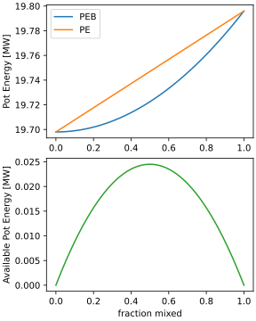

So, inhomogenous mixing can create available potential energy or pressure gradients that drive the overturning circulation.  This can also be caused by buoyancy differences at the surface and homogenous mixing.  A nice demonstration of this was due to Bryan (1987, _J. Phys Ocean_) (plots below) where he ran an overturning circulation with increasing diffusivity co-efficients $A_{HV}$ (which we called $K$ above).  The model is forced by heating at the north end and cooling that has a maximum at 75 degrees Latitude (He had it warming at higher latitudes for some reason).  Weak mixing, the warm water at the surface is not mixed down very far (upper left plot).  As the mixing increases, the warm water is mixed deeper and deeper.  The correspoding overturning circulation is shown on the right column, and clearly the stronger mixing leads to a much greater overturning transport. In his simulations, the power law was relatively weak with $q \sim K^{1/3}$ (bottom plot).  In higher resolution simulations where mixing is more carefully applied, the power law tends to be closer to $q\sim K^{2/3}$ (in fact you can see hints of this here in the higher $K$ values of this plot; what likley happened in Bryan's case is "numerical diffusion" dominating the mixing at the nominally weaker $K$ values, so practically there was still more mixing in those than represented explicitly by $K$)

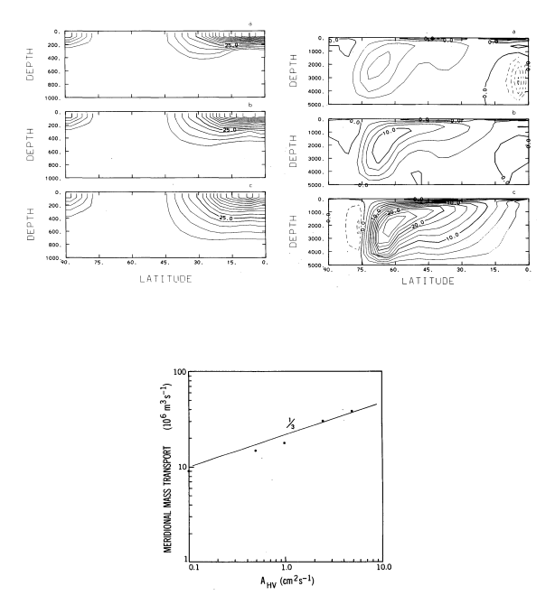

All of this was nicely summarized by Sandstrom (1908, _Annales Hydrographiques_) who argued that the interior circulation in a tank would be very small if a warm and cold buoyancy source were located with the cold source at or below the same level as the warm source.  If the cold source is above the warming source, a convective circulation will develop. However, if they are at the same level, then there will be a very local circulation from the warm source to the cold, and all the water above the warm source will be warm, and all the water below will be cold.

## Lateral circulation of thermohaline water: Stommel-Aarons theory

There is a lateral circulation associated with the production of deep water at the poles.  First we might expect this deep water to turn with the Coriolis force, so southern ocean water flowing poleward would turn to the left, and hence flow along western boundaries.  You can see that in the plot below where salty and oxygenated abyssal southern ocean water spills into the Pacific along the west side of the basin.  This current was predicted _before_ it was observed.

The earth is actually a sphere, but for simplicity, lets derive the theory in a rectangular basin on a beta plane ($f=f_0+\beta y$).  Suppose there is a source of dense water at the north end of the basin with strength $S$ (in Sv).  If there is a downwelling of $S$, then there must be an equal and opposite upwelling elsewhere in the basin, and again lets assume that it is constant everywhere $w = S/A$ where $A$ is the area of the basin.  Then we can see from the  conservation of potential vorticity that:
$$\frac{\mathrm{D}}{\mathrm{D}t}\left(\frac{f}{H}\right) = \frac{1}{H}\frac{\mathrm{D} f}{\mathrm{D}t} - \frac{f}{H^2}\frac{\mathrm{D} H}{\mathrm{D}t}=0$$
or
$$\beta v = \frac{f}{H}w$$
We can write as a transport as
$$ S_{Int} = H v X = \frac{f}{\beta}\frac{S}{Y}$$
where $X$ is the east-west extent of the basin and $Y$ is the north-south extent.

Note that this transport is going northwards in the northern hemisphere, and southwards in the southern, so if the source of deepwater is in the north, the transport is going towards the source of dense water.  This water must return south _and_  the dense water must flow south to feed this flow.  As for the Sverdrup circulation, we assume this happens via sidewall torques, and a northward interior flow must return towards the south along the western boundary.

How strong is the western boundary current? To calculate this, we can think of a volume at some latitude $0<y<Y$ that spans the basin in the east-west direction, and extends to the southern extent of the basin $y=0$.  Water flows in the western boundary current with transport $S_W$, and flows out due to the water upwelling out the top and the water flowing north due to the vortex stretching:

$$S_W = S_{Int} + w X y = \frac{fS}{\beta Y} + S \frac{y}{Y} = \frac{S}{Y}\left(\frac{f}{\beta} + y\right) = \frac{S}{Y}\left(\frac{f_0}{\beta} + 2y\right)$$
If $y=0$ is at the equator, then $f_0=0$ and we have
$$S_W = \frac{2Sy}{Y}$$
Note that the western boundary current has no net transport at the equator, and increases to a maximum of $S_W = 2S$ at the northern boundary ($y=Y$).

Note that the east-west flow must be everywhere towards the east, except at the northern boundary where there is also a return flow to the west.  This is pictured in the figure below and works for the North Atlantic and South Atlantic, Pacific, and Indian Oceans.  The North Pacific has no source of dense water, but there is water flowing across the equator in a Deep Western Boundary Current.  If we recast the equations above for this situation, then if we set the sign so that if $S_W>0$ it is flowing northward we get:
$$S_W = S - S_{Int} - w X y = S - \frac{fS}{\beta Y} - S \frac{y}{Y} = \frac{S}{Y}\left(Y-y - \frac{f}{\beta} \right) = \frac{S}{Y}\left(Y - \frac{f_0}{\beta} - 2y\right)$$
or if $f_0=0$
$$S_W = \frac{S}{Y}\left(Y-2y\right)$$
and we note then that $S_W>0$ if $y<Y/2$, so it flows north for the first half of the basin, but south north of that point (note that below this is not sketched at the midway point because the North Pacific is more like a wedge than a rectangle, so the geometry is different).

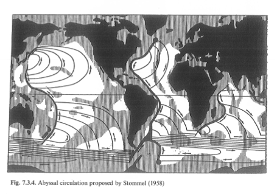

Observational campaigns since this model was proposed in the 1950s have confirmed the presence of a _deep western boundary current_ largely as pictured above.  The one in the Atlantic is the most clear and is coherently observed for thousands of kilometers.  The first plot is taken just off the grand Banks, whereas the second is taken off Cape Hatteras.

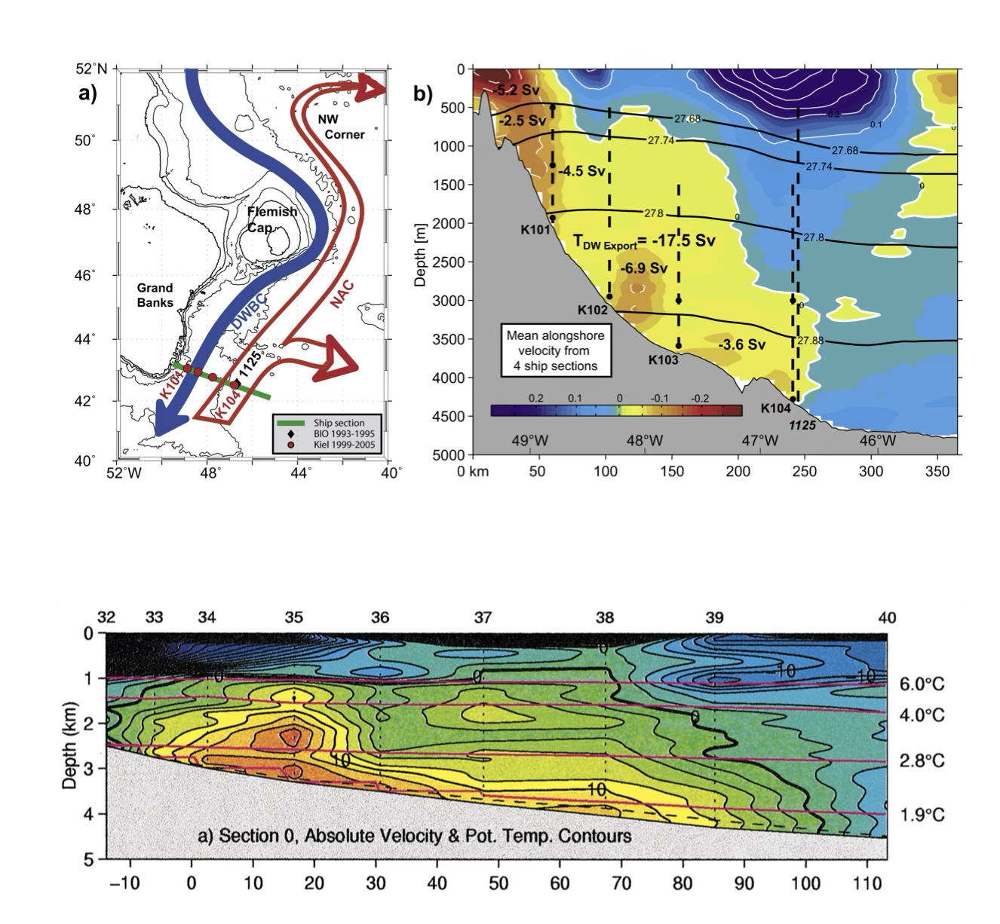

